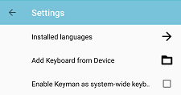
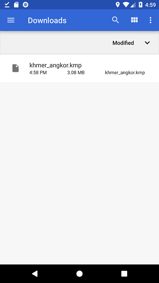
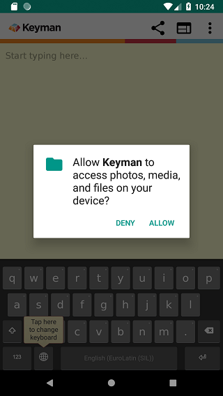

## Overview

In [Keyman for Android 10.0](/products/android/10.0/), we added the ability to
easily download/share custom keyboards to your Android device.

## Installing a custom keyboard

To install a custom keyboard, you will need a link to download the
keyboard package. If you have already copied the kmp file onto the
Android device, skip to Step 2.

If you want to build and dev your own keyboard, you will need some
technical skills for this, and can read our full step-by-step
instructional on how to do this [here](packages).

Once you have a website or email with a link to the keyboard package,
follow these steps on your Android device to download and install the
keyboard package into the Keyman for Android application:

## Step 1) Click the link to save your custom keyboard package file

The link in this example is for Khmer Angkor keyboard.

## Step 2) Add Keyboard from Device

Once the KMP file is on your device, you will need to browse to the KMP
file and select it. From the Keyman menu, select "Settings". From the
Keyman Settings menu, select "Add Keyboard from Device".

The device will launch a file browser where you'll browse to the
directory of your KMP file. A common places to look is the "Downloads"
folder.

Selecting the KMP file should bring you to Step 3)

## Step 3) Grant Keyman for Android access to storage (Android 6.0+ only)

On Android 6.0 (Marshmallow) and higher, mobile apps need to request
permission to access storage. Keyman for Android needs access to read
storage for installing the KMP file. At the dialog, select "ALLOW". Once
authorized, Keyman for Android won't need to ask for storage permission
again, unless the user revokes or uninstalls the app.

Older versions of Android grant Storage permissions at app installation
time, so those users can skip this step.

## Step 4) Keyboard Package welcome screen

Keyman for Android will parse the metadata in the package. If the
keyboard package includes a "welcome.htm" file, this will be displayed
at the confirmation to install the keyboard package

If "welcome.htm" is not included, a generic page with the package ID and
package version will be shown.

Click the left "Install" button to install the entire keyboard package

## Step 5) The keyboard is successfully installed!

All the keyboards in the package are installed as a group. In this
example, the package only has the "Khmer Angkor" keyboard, so it becomes
the active keyboard

