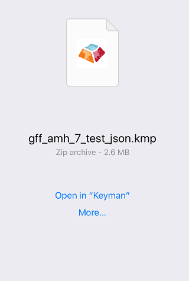
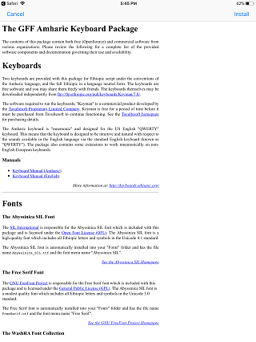
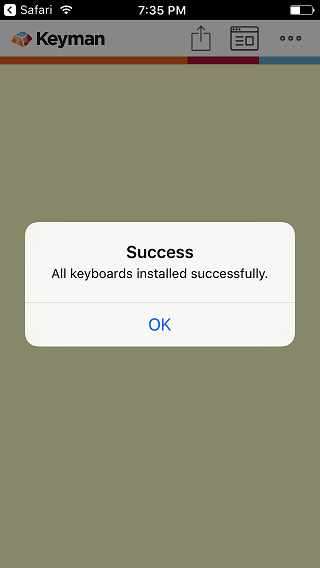
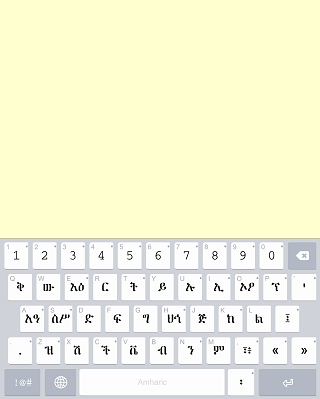

## Overview

In version 10 of Keyman for iPhone and iPad, we added the ability to easily download custom keyboards to your iOS device.

## Installing a custom keyboard

To install a custom keyboard, you will first need a link to the keyboard
package on a website or in your email.

If you want to build and dev your own keyboard, you will need some
technical skills for this, and can read our full step-by-step
instructional on how to do this [here](packages).

Once you have a website or email with a link to the keyboard package,
follow these steps on your iPhone or iPad to download and install the
keyboard package into the Keyman for iPhone and iPad application:

## Step 1) Click the link to your custom keyboard package file

The link in this example is for GFF Amharic 7 keyboard.

Safari will display an option to open the KMP file with Keyman

## Step 2) Click Open in "Keyman"

Keyman for iPhone and iPad will parse the metadata in the package. If
the keyboard package includes a "welcome.htm" file, this will be
displayed at the confirmation to install the keyboard package

If "welcome.htm" is not included, a generic page with the package ID and
package version will be shown.

## Step 3) Click the top right "Install" button

The keyboard from the keyboard package is successfully installed!

All the keyboards in the package are installed as a group. In this
example, the package only has the "GFF Amharic 7" keyboard, so it
becomes the active keyboard

