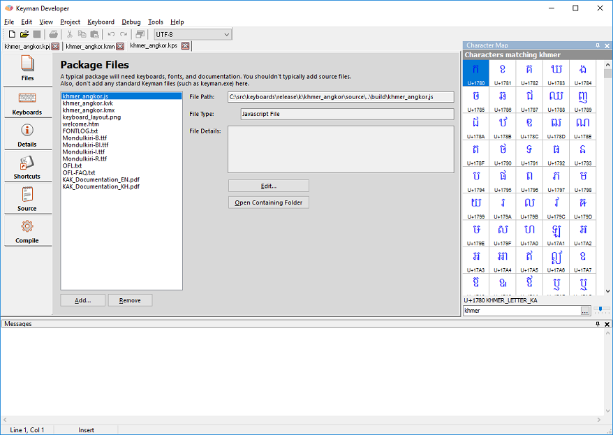
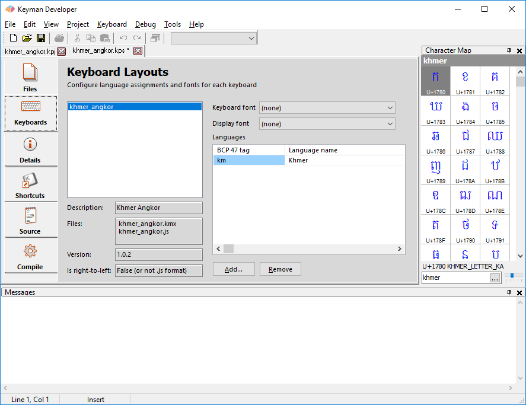

We are finally ready to open up the Package Editor and create the new
package.

-   In the Project Window in Keyman Developer, click the **Packages** tab, and click **New Package...**. Enter the path and filename of the package you are creating.

> ### Tip
This tutorial makes a package named `khmer_angkor.kps`, but you could call yours `qfrench.kps`.

A package source file will have the extension .kps, and will be compiled in a file with extension .kmp.

After you click OK, the Package Editor will open with the Files tab visible.

-   In the Files tab, click **Add...** to add
    all the files we discussed in the previous step to the package. You
    can add multiple files at once, and from multiple folders. When the
    package is compiled, all the files will be placed in the same folder
    within the package.
-   If your package includes .js touch layout keyboards, you can
    associate fonts and languages in the Keyboards tab. A valid [BCP 47 language tag](../../../reference/bcp-47) must be set or the keyboard will not install on your mobile device.

You could stop here. This would be a completely valid package, but it would not be as good as it could be. So let's continue on to the next step, and fill in some descriptions of the package.

[Step 4: Filling in package details](step-4)