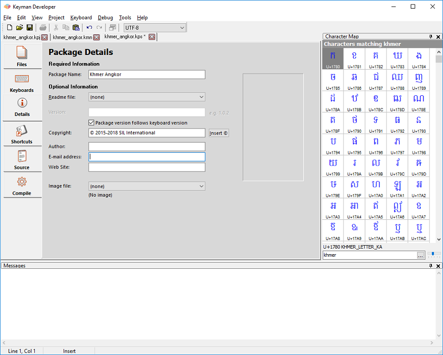

Click on the Details tab in the Package Editor. You should fill in as
many details as you can on this page.

Package Name

:   The Package Name will be displayed in the package install dialog,
    and within Keyman Desktop Configuration, wherever the package is
    referred to.

Readme File

:   Select the readme file from the list of files you added in the
    previous step. Remember that it should be a HTML file for optimum
    clarity.

Version

:   A version number for the package is important - it helps the your
    users know that they are using the most recent update of your
    package. The version format you should use is `1.0`. When making a
    major change to your package or keyboards in your package, increment
    the first part and set the second part to, e.g. `2.0`; when making a
    bug fix or a minor update, increment the second part, e.g. `1.1`.

Version numbers should be in the form `major.minor[.subversion]`.
    Subversion is optional but is helpful for small bug fix releases.
    Each of the sections of the version should be an integer. Keyman
    Desktop does integer comparisons on the version numbers, so, for
    example, version `2.01` is regarded as older than version `2.2`.
    Alphabetic or date formats should be avoided as the installer for
    the keyboard cannot determine which version is older reliably.

Copyright

:   Enter copyright details for your package and keyboards. Keep this
    reasonably short or it won't be clear for end users.

Author

:   Enter your name or the name of your company.

Email

:   Enter a contact email address where package users can contact you.
    If you don't want to be contacted via email, leave this field empty

Website

:   Enter the name of the website where you will have information about
    this keyboard. If you want to host it on keyman.com, you could enter
    `https://keyman.com/`

Image file
:   Select the splash image file that you created in Step 2 from the
    list of files in your package.

[Step 5: Shortcuts](step-5)
