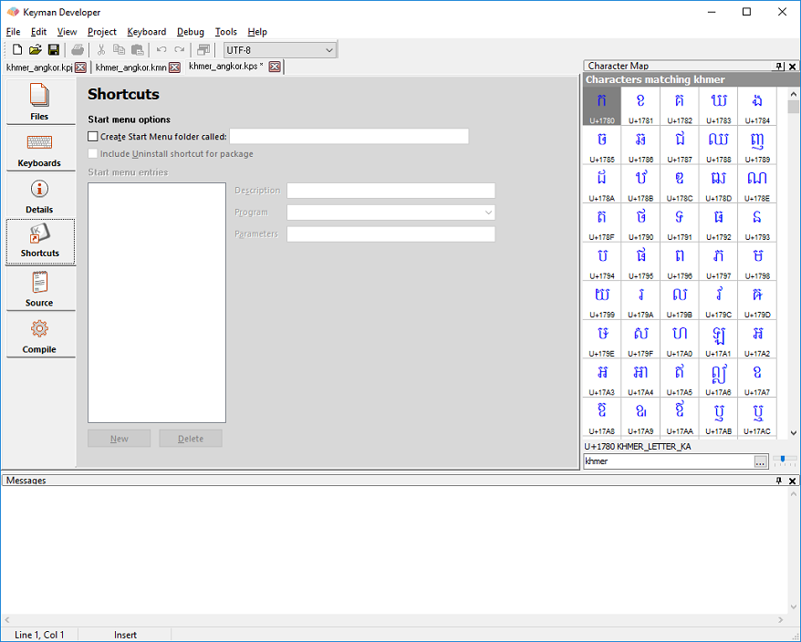

Click on the Shortcuts tab in the Package Editor.

While it may be a good idea to include Start Menu shortcuts for your
package, on recent versions of Windows these are not very visible to end
users. This means that you should ensure that all instructions are
available through the **welcome.htm** file as well. The Start Menu
shortcuts were designed originally for Windows-based keyboard packages
and work slightly differently in macOS.

You should consider adding the following items to the Start Menu:

-   Documentation shortcuts
-   Welcome.htm shortcut

> ### Note
While Keyman Developer 8.0 and earlier versions of the documentation
advised including an uninstall shortcut to the package, this is no
longer recommended. Users should uninstall your package from Keyman
Configuration. Adding an uninstall shortcut to the package adds
confusion to the Start Menu search on Windows, and is not compatible
with macOS keyboards.

Click **New** to add a new shortcut to the
package. Enter a description for the shortcut, and select the program or
file to start from the Program list. Four predefined program entries
(Start Product), (Product Configuration), (Product Help) and (About
Product) will be translated into the appropriate shortcuts to start
Keyman Desktop tasks as described.

> ### Note
In Keyman 6 and earlier, the predefined targets $KEYMAN\keyman.exe and
$KEYMAN\kmshell.exe were available. These are translated to (Start
Product) and (Product Configuration), respectively, in Keyman Desktop
7.0 and later versions.

<!-- a seperator -->

> ### Tip
Packages are not listed in the Control Panel Add/Remove Programs applet
with Keyman Desktop 7.0 and later versions. Packages can be uninstalled
through the Start Menu shortcut or from Keyman Desktop Configuration.

[Step 6: Compiling, testing and distributing a Package](step-6)