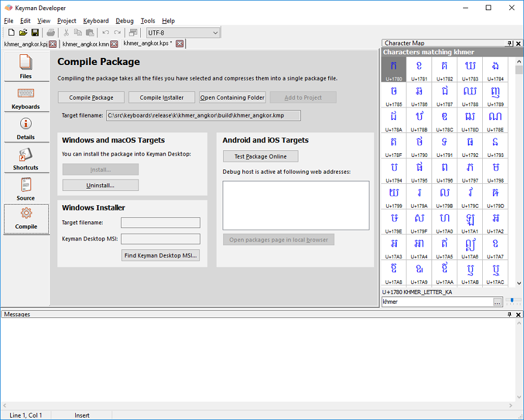

In the Package Editor, click on the **Compile** tab.

Click **Compile Package** to compile the
package into a .kmp file. Compiling takes all the files listed for the
package, compresses them (using a .ZIP-compatible format) and adds the
package information, all into a single file. If any files are not
available, an error will be listed in the Messages window.

After compiling, you can test the package installation in Keyman
Desktop, by clicking **Install Package**. You
should test that all the keyboards and fonts install successfully, that
the Readme and Welcome files are displayed during the install, and that
the documentation is accessible to the end user. Make sure that the On
Screen Keyboard installs with your keyboards, and that the shortcuts are
correctly listed and working in the Start Menu.

> ### Advice
The distribution model for Keyman keyboards is changing. We now
recommend distributing source for keyboards through the [Keyman Cloud Keyboard Repository](/developer/keyboards/). The instructions here
remain, but the binary distribution model is deprecated.

## Distributing a package on the Keyman Cloud Keyboard Repository

Once you have tested the package to your satisfaction, it is time to
distribute it. We recommend uploading your keyboard package to the
[Keyman Cloud Keyboard Repository](/developer/keyboards/)

## Distributing a package on your own website

If you distribute a package on your own site, we have the following
recommendations:

1.  Ensure the MIME type on the web server or folder for .KMX and .KMP
    files is set up to application/octet-stream. Without this, .KMP
    files may be recognised as .ZIP files -- this is not helpful to the
    end user as it will be opened in the wrong application. If you can't
    make this change, consider hosting the keyboard package on the
    Tavultesoft website to make things easier for your end user.
2.  Avoid putting the .KMP file in an archive (e.g. .ZIP) or
    self-expanding archive (.EXE) - this makes it harder for end users
    to install. A .KMP file is already compressed (it is actually just a
    ZIP archive file!) and you won't save much space by recompressing
    it.
3.  Include a link to the Keyman download page:
    `http://keyman.com/desktop/`

## Distributing a package by email

Attaching the KMP file directly to an email may be blocked for security
reasons. As mentioned above, a KMP file is basically a ZIP file and
mobile keyboard data is in JavaScript, this is a combination that looks
suspicious to many email servers. You can upload it to a Google drive,
and email a link for downloading the file

You may need to do some exploring to get your mobile device to load the
keyboard from the KMP file into Keyman. The device may not open the file
directly, claiming it is an unrecognized type. If you look for other
options to open the file, hopefully you can get it to Keyman. For
example, in iOS, I had to tap on the three dots to the right, then
choose "Open in" and then I could choose "Copy to Keyman." In Android, I
had to download the file to my device, then open the KMP file in a file
manager before I could install it in Keyman.