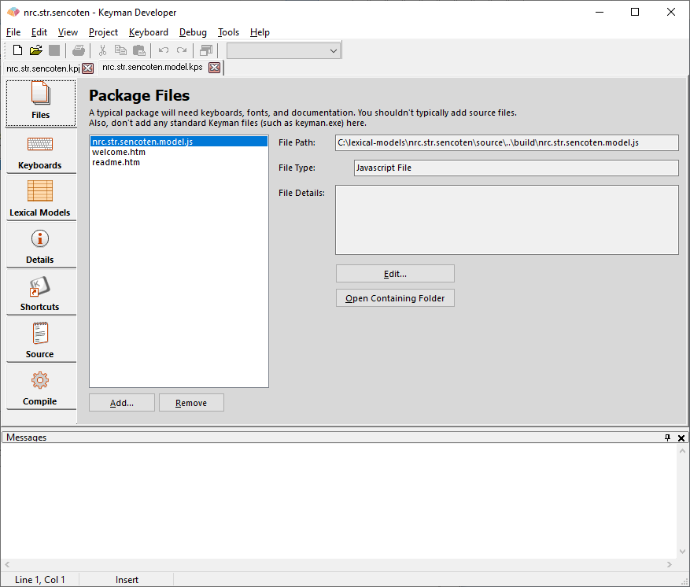
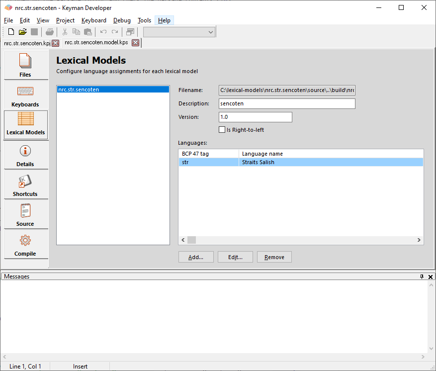

We are finally ready to open up the Package Editor and check the package
contents. In the Project Window in Keyman Developer, click the
**Packaging** tab.

> ### Tip
This tutorial makes a package named `nrc.str.sencoten.model.kps`, but
you should substitute the name with your own model.

A lexical model package source file will have the extension .model.kps,
and will be compiled in a file with extension .kmp.

## Files

In the Package Editor, click on the **Files**
tab.

Keyman Developer already included your lexical model, welcome.htm, and
readme.htm files in your package. In the Files tab, click
**Add** to add all the additional files we
discussed in the previous step to the package. For example, if your
welcome or readme files use embedded files, include them in your
package. You can add multiple files at once, and from multiple folders.
When the package is compiled, all the files will be placed in the same
folder within the package.

While keyboards can also be distributed in packages, do not include them
in a lexical model package.

## Lexical Models

In the Package Editor, click on the **Lexical Models** tab.

Language Tag

:   A valid BCP 47 language tag must be set or the lexical model will
    not install on your mobile device. Update the list of languages you
    want to associate with your lexical model.

You could stop here. This would be a completely valid package, but it
would not be as good as it could be. So let's continue on to the next
step, and fill in some descriptions of the package.

[Step 4: Filling in package details](step-4)