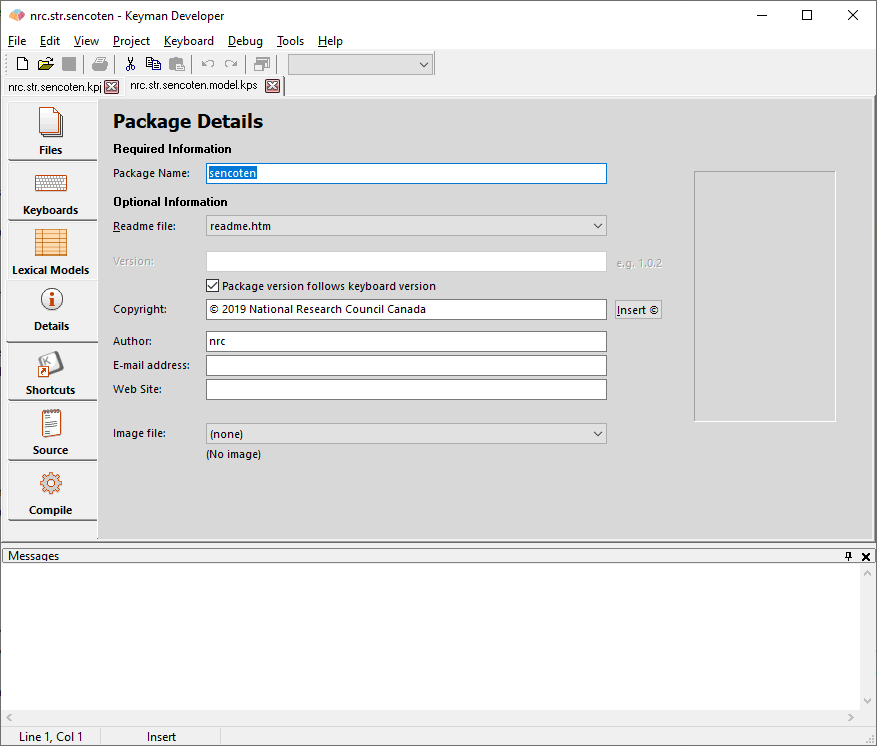

In the Package Editor, click on the **Details** tab. You should fill in as many details as you can on this page.

Package Name

:   The Package Name will be displayed in the package install dialog and
    wherever the package is referred to.

Model Version

: Update the version (intial version can default to 1.0). A version
  number for the model and package is important - it helps your users
  know that they are using the most recent update of your package. The
  version format you should use is `1.0`.

  When making a major change to your lexical model package, increment
  the first part and set the second part to `0`, e.g. from `1.0` to
  `2.0`.

  When making a bug fix or a minor update, increment the second part,
  e.g. from `1.0` to `1.1`.

  Version numbers should be in the form `major.minor[.subversion]`.
  Subversion is optional but is helpful for small bug fix releases.
  Each of the sections of the version should be an integer. Keyman
  does integer comparisons on the version numbers, so, for example,
  version `2.01` is regarded as older than version `2.2`. Alphabetic
  or date formats should be avoided as the installer for the model
  cannot determine which version is older reliably.

Copyright

:   Enter copyright details for your lexical model package. Keep this
    reasonably short or it won't be clear for end users.

Author

:   Enter your name or the name of your company.

Email

:   Enter a contact email address where package users can contact you.
    If you don't want to be contacted via email, leave this field empty

Website

:   Enter the name of the website where you will have information about
    this lexical model.

[Step 5: Compiling, testing and distributing a Package](step-5)