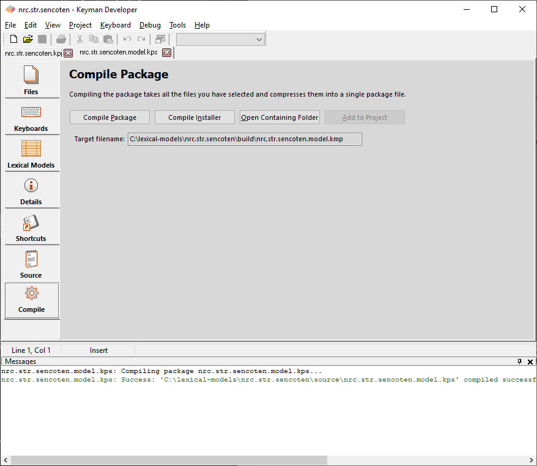

In the Package Editor, click on the **Compile** tab.

Click **Compile Package** to compile the
package into a .kmp file. Compiling takes all the files listed for the
package, compresses them (using a .ZIP-compatible format) and adds the
package information, all into a single file. If any files are not
available, an error will be listed in the Messages window.

After compiling, you can test the package installation in the mobile
Keyman apps. You should test that all the model installs successfully,
that the Welcome file is displayed during the install, and that the
documentation is accessible to the end user.

## Distributing a package on the Keyman Cloud Lexical Model Repository

Once you have tested the package to your satisfaction, it is time to
distribute it. We recommend submitting your lexical model package to the
[Keyman Lexical Models Repository](https://github.com/keymanapp/lexical-models)

## Distributing a package on your own website

If you distribute a package on your own site, we have the following
recommendations:

1.  Ensure the MIME type on the web server or folder for .KMP files is
    set up to application/octet-stream. Without this, .KMP files may be
    recognised as .ZIP files -- this is not helpful to the end user as
    it will be opened in the wrong application.
2.  Avoid putting the .KMP file in an archive (e.g. .ZIP) or
    self-expanding archive (.EXE) - this makes it harder for end users
    to install. A .KMP file is already compressed (it is actually just a
    ZIP archive file!) and you won't save much space by recompressing
    it.
3.  Include a link to the Keyman download page:
    `https://keyman.com/downloads/`

## Distributing a package by email

- Attaching the KMP file directly to an email may be blocked for security
reasons. As mentioned above, a KMP file is basically a ZIP file and
lexical model data is in JavaScript, this is a combination that looks
suspicious to many email servers. You can upload it to a Google drive,
and email a link for downloading the file

## Installing the lexical model package

- The same method for installing custom keyboard packages to mobile
devices can be used for installing lexical model packages. Refer to
these pages for [Keyman for iPhone and iPad](../../../distribute/install-kmp-ios) and [Keyman for Android](../../../distribute/install-kmp-android).