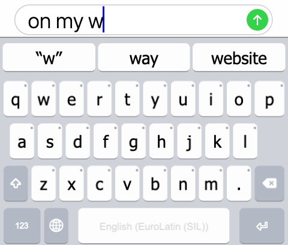
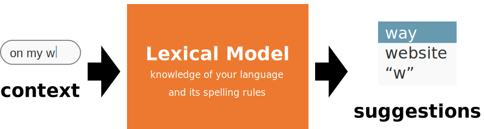
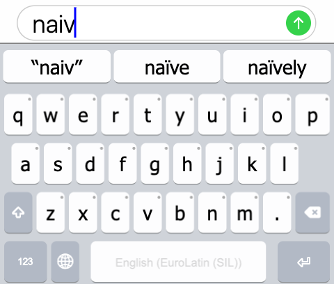
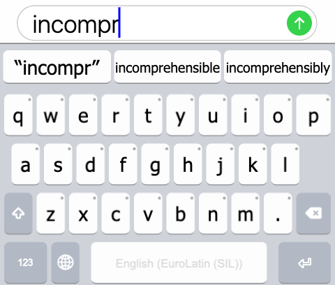
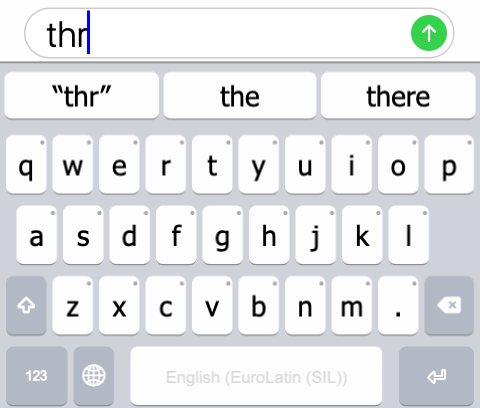

##### Predictive text for English.

Many mobile phone keyboards enjoy **predictive text** for their
languages.

Predictive text is the feature on your keyboard that displays a series
of _predictions_, typically above your keyboard,
that try to guess the word or words that you are typing next. For
example, if I start typing the English phrase “On my w”, your keyboard’s
predictive text feature will infer, using its knowledge of the English
language, that the word you are typing is most likely “way”, followed by
other, less likely suggestions, such as “whole”, or “website”.

The same feature that provides predictive text can also suggest
_corrections_ to what you are typing. For
example, if I start typing “thr” on my English keyboard, my keyboard
will suggest that I meant to type “the” instead. This **autocorrect**
feature is powered by your keyboard’s knowledge of the current language.

The way your keyboard knows how to suggest **predictions** and
**corrections** for your language is through its **lexical model**.

##### How the lexical model is involved in generating suggestions.

## Why should I create a lexical model for my language?

### Words are difficult to type

##### Typing “naiv” on a smartphone with predictive text.

Some words have many accents, diacritics, or similar-looking forms. This
is not very common in the English language, however, this is quite
common in other languages. Predictive text can recognize forms without
the correct diacritics, or recognize forms that are simpler to type than
the orthographically correct version. This allows the typist to type
words quickly, with minimum effort.

For example, in English, I want to type “naïve”, however, my keyboard
does not have the <kbd>ï</kbd> key present on its main
layout. Sure, if I use a keyboard that I can press-and-hold the
<kbd>i</kbd> key, it may pop-up additional characters,
and I can probably find <kbd>ï</kbd> nestled there
among the other options. However, I have to go out of my way to type the
correct variant, whereas the incorrect variant will be perfectly
understood. In most cases, I choose the option that is more economical
to type–“naive”—rather than the “correct” option.

However, a **lexical model** that understands the English language will
see the word “naive” does not exist, but a similarly typed variant
“naïve” does exist. Therefore, when I type “naive”, the lexical model
will suggest “naïve”, and I can select it and have the correctly spelled
version without having to long-press and select the correct “ï”. Even
better than that, I can choose the suggestion right after typing “naiv”,
as there are relatively view English words that start with the prefix of
“naiv-”

### Words are long

Typing “incompr” on an English keyboard.

Sometimes, the words are very long, but can be typed in far fewer
keystrokes if predictive text is used. For example, if in English, I
want to write the word “incomprehensible” (a 16-letter word), a lexical
model for English can predict it from the prefix “incompr” and save 8
keystrokes!

English is not prone to extraordinarily long words; the average word
length in English is about 9 letters. However, languages that are fond
of compounding, such as German (e.g.,
_scheinwerferreinigungsanlage_ is a 28-letter word
which means “headlight washers”), or _polysynthetic
languages_ in which one word can have the meaning of a complete
sentence in English, such as Mohawk (e.g.,
_sahonwanhotónkwahse_ is a 20-letter word which
means “she
opened the door for him again”). For these languages, predictive
text can save even more keystrokes than in English.

### People make mistakes

##### Typing “thr” on an English keyboard.

When typing quickly on a small phone screen, mistakes are inevitable.
Say I try to write the word “the” on my phone. I press
<kbd>t</kbd>, then <kbd>h</kbd>, but
as I try to type <kbd>e</kbd>, I press a few
millimeters to the right of the intended key and press
<kbd>r</kbd> instead. With a lexical model, the
predictive text feature understands that in English, “thr” is not a
complete word in-and-of-itself; however, a word that is typed quite
similarly, “the”, is a very common word. Therefore, the lexical model
provides enough information to assume that the user intended to type
“the” instead of “thr”. Thus, one of its **suggestions** is the
**correction** of “the” in place of “thr”.

However, the predictive text feature is not overly presumptuous; what if
the typist really did want to type “thr”? As a result, “thr” is
suggested as a _keep suggestion_. When the typist
selects the “keep” suggestion, whatever they had originally typed is
kept, even if the lexical model suggests what it thinks is a far more
likely correction.

## What do I need to make my own lexical model?

To make a lexical model, you need some information about your language.
At bare minimum, you need a list of words in your language. Keyman
Developer supports importing a word list as a spreadsheet of words in
your language that you wish to use for predictions and corrections. This
will create a _word list lexical model_.

If you have such a list of words, you can continue to the
[tutorial](../tutorial) to create a word list lexical model for your
language!

However, to make a more accurate lexical model, you will need an idea of
how to rank suggestions relative to each other. For this, you may extend
the simple word list with **counts**. Each word has a count of how often
it has been seen in a representative collection of texts in your
language. For example, I could download articles from the English
language Wikipedia, and count how often Wikipedia contributors have
typed “rule” versus how many times they have typed “rupturewort”. This
will help us understand how to rank these two suggestions given the
context of “ru”.

You can extend your spreadsheet with counts (placed in the second
column) to make a more accurate—and thus more useful—lexical model.

[Next: Developing a lexical model from a word list](../tutorial)