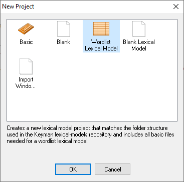
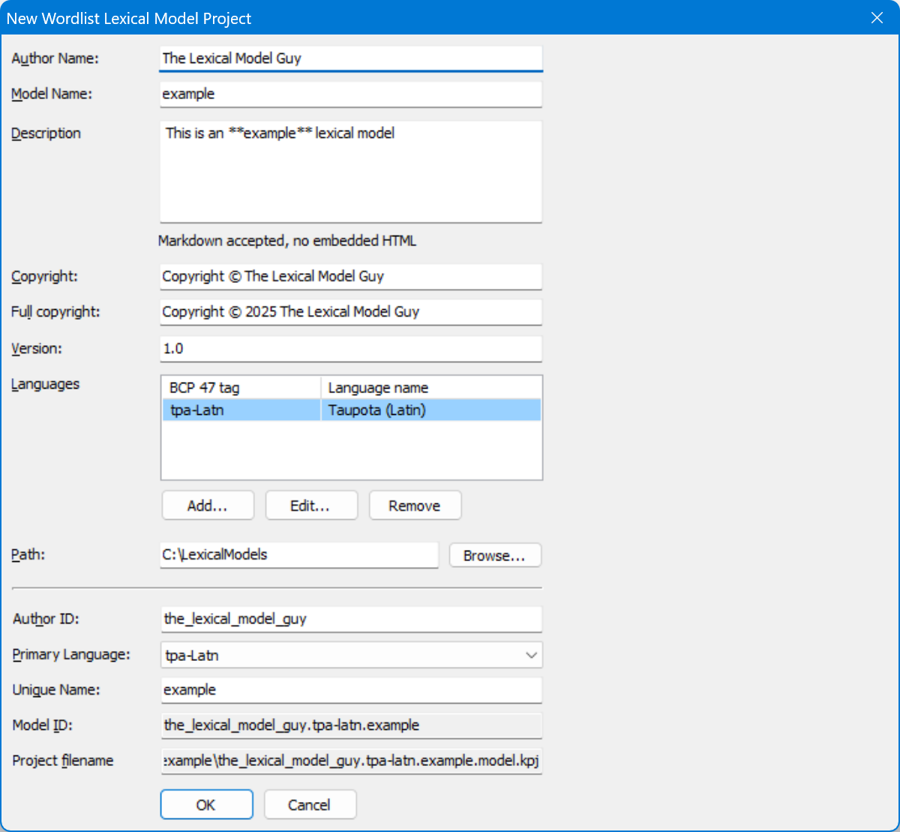
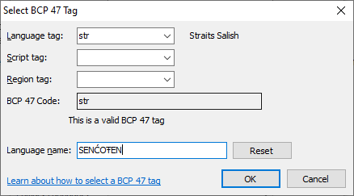

## Create the new project

Start Keyman Developer. On the “Welcome” screen, click on
**New Project...**. The “New Project” dialog
will appear. Select “Wordlist Lexical Model” and press
**OK**.

###### The “New Project” dialog, with “Wordlist Lexical Model” selected.

## Provide required information

###### The New Lexical Model dialog box.

The “New Wordlist Lexical Model Project” dialog will appear.

To make sharing your lexical model easier, a project needs the following
information:

Author Name
:   This is either your **full name** or the **organization** you're
    creating a model for. In this example, I am creating a lexical model
    on behalf of my organization, the National Research Council Canada,
    so I write that as the author name.

Model Name
:   We recommend the name of the **language**, **dialect**, or
    **community** that this model is intended for. The name must be
    written in all the Latin letters or Arabic numerals. In this
    example, we're creating a language model for SENĆOŦEN, so we use the
    model name `Sencoten`.

### Provide auxiliary information

The following information is also required, but most users will use
**default values**.

Copyright
:   Who owns the rights to this model and its data? This field should
    contain the word "Copyright", the copyright symbol "©", and the full name of the rights
    owner. Do not put the year of copyright in this field (see Full Copyright). Typically,
    you can use the automatically generated default value:  *Copyright © **Your Full
    Name or Your Organization***.

Version
:   If this is the first time you've created a lexical model for you
    language, you should leave the version as **1.0**. Otherwise, your
    version number must conform to the following rules: A version string
    made of `major revision number`.`minor revision number`.

## Determine your language's BCP 47 language tag

Keyman needs to know how to link your model to the appropriate keyboard
layout, so that they can both work together. To do this, Keyman utilizes
[BCP 47](../../../reference/bcp-47) language tags.

To add a language tag, click the **Add**
button to bring up the “Select BCP 47 Tag” dialog box.

###### The “Select BCP 47 Tag” dialog box for SENĆOŦEN.

Enter the BCP 47 language tag that you have selected. [Learn more about BCP 47 language tags](../../../reference/bcp-47)

Once you are finished adding the primary language, click
**OK** to return to the **New Lexical Model
Project dialog**.

## The Model ID

Keyman will create a **model ID** which is how
Keyman sorts and organizes different lexical models. If you choose to
share your model publicly, the model ID is vital for both people and
Keyman to identify and use your lexical model!

Keyman automatically generates a model ID for you, given all the
information already filled out. If you're satisfied with the generated
model ID, you can [skip to the next step](#toc-double-check-the-information).

In this example, my generated model ID is
`national_research_council_canada.str.sencoten`, derived from my
organization name, the name of the primary language, and my model name.
However, I find the “author ID” part of the generated model ID
excessively long. I changed the author ID to `nrc`, and the model ID
automatically changes to the much more manageable `nrc.str.sencoten`.

## Double-check the information

Verify that all of the information is correct. Once all of the required
information has been filled in and verified, click
**OK** to create the project.

Once we have created the project, we can begin to prepare the data!

[Step 3: Get some language data](step-3)
