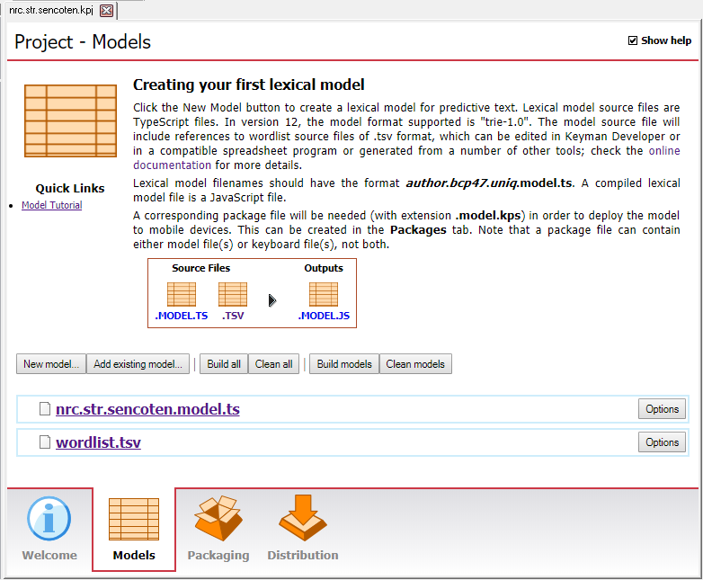
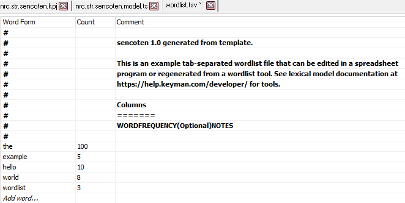
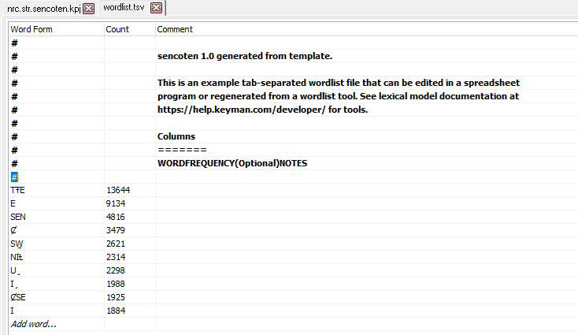
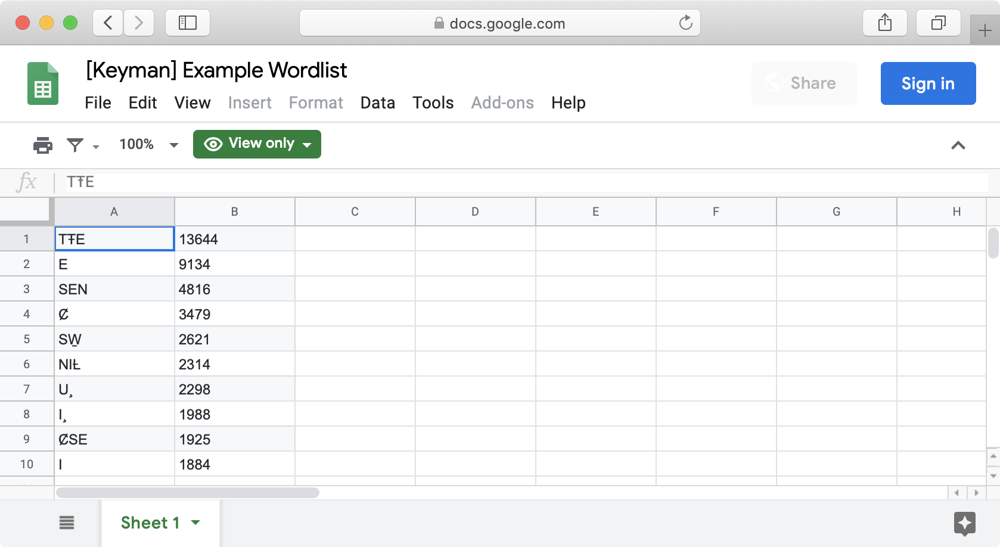
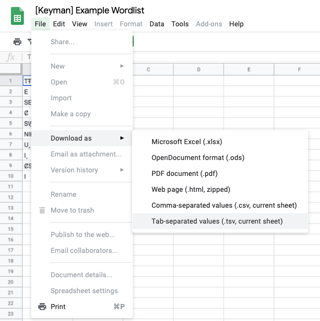

To predict words in your language, a lexical model needs to know the
words in your language!

Keyman Developer understands how to read words in a [TSV file](../../../reference/file-types/tsv). This kind of file can be saved
from a **spreadsheet** application like [Google Sheets](https://sheets.google.com/) or [Microsoft Excel](https://products.office.com/en/excel). Other users may also use
**language data management software** like [SIL FieldWorks Language
Explorer (FLEx)](https://software.sil.org/fieldworks/) to export an
appropriate **TSV** file.

One simple way to create your TSV file is to use the **PrimerPrep**
tool:

1.  Install PrimerPrep (info at
    <http://lingtransoft.info/apps/primerprep>)
2.  Run PrimerPrep (note that on the first run it often takes a couple
    of minutes; subsequent starts are faster)
3.  Click on the Add Text(s) button; select one or more plain text
    (UTF-8) files in the language to analyze
4.  The word list with frequency counts appears in the pane to the right
5.  From the File menu, select Save Word List… and specify the file name
    and location (a .tsv extension is recommended)

> **For advanced users**: Ultimately, what Keyman Developer requires is a
tab-separated values (TSV) file in a specfic format described in the
[file types reference](../../../reference/file-types/tsv). Refer to this
reference file if you are coding your own exporter.

## Example Wordlist

I have words in my language of choice, SENĆOŦEN. Here is my list of
words, with the count of how many times I’ve seen the word:

List of ten SENĆOŦEN words, with counts

| Word  | Count |
|-------|-------|
| TŦE   | 13644 |
| E     | 9134  |
| SEN   | 4816  |
| Ȼ     | 3479  |
| SW̱    | 2621  |
| NIȽ   | 2314  |
| U¸    | 2298  |
| I¸    | 1988  |
| ȻSE   | 1925  |
| I     | 1884  |

## Editing the .TSV in Keyman Developer

If you plan to only edit a few entries for your wordlist, you can use
the TSV editor in Keyman Developer. The project template created a
wordlist named **wordlist.tsv** that we will now edit.

In Keyman Developer project view, select the Models tab and click on
wordlist.tsv.

##### Open a .tsv file in Keyman Developer

Keyman Developer already generated a few example words when it created
the template wordlist.tsv file.

##### Template wordlist.tsv

We will replace these entries with SENĆOŦEN words from our wordlist. For
each row, edit the "Word Form" and "Count". Counts are optional for each
word: that is, some words may specify counts in the second column, while
other words may leave the second column blank. To create a new entry at
the bottom, click "Add word...". When you are finished, you'll have a
wordlist that looks like this:

##### Edited wordlist.tsv for SENĆOŦEN

After saving your wordlist file, you can move on to Step 4.

## Editing the .TSV in Google Sheets

Alternatively, you may want to use a different spreadsheet tool for
editing large wordlists. I’ve entered this information into my
spreadsheet of choice, [Google Sheets](https://sheets.google.com/). I’ve
shared this spreadsheet publicly
[here](https://docs.google.com/spreadsheets/d/10zhIc439BCSSooL_-HeJ6TUHd-ovkiXYcIGe-pHDTSg/edit?usp=sharing).
The order of the columns matters:

The first column (column A) **must** be the “words”. If provided, the
second column (column B) **must** be the “counts”. Counts are optional
for each word: that is, some words may specify counts in the second
column, while other words may leave the second column blank. The third
column (column C) is always ignored. You may use this column as a
comment. The spreadsheet can be as simple as a single column of all of
the words in the language, with each word being separated by a line
break.

This is what my word list looks like in Google Sheets:

##### The word list, as it appears in Google Sheets

Now, we download the spreadsheet in the [required format](../../../reference/file-types/tsv). To do this, in Google
Sheets, select “File” » “Download as” » “Tab-separated values (.tsv,
current sheet)”.

##### Exporting the TSV file from Google Sheets

I’ll save mine as **wordlist.tsv**.

Now that we have our word list, let's compile our model!

[Step 4: Compiling the lexical model](step-4)