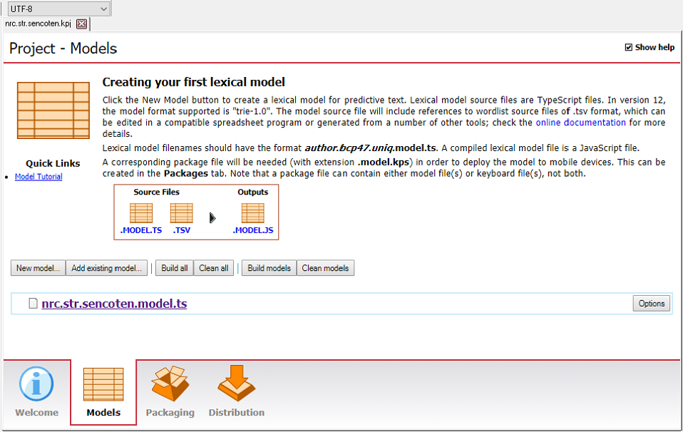

Before use the lexical model, we must compile it. In this step, the
`.tsv` wordlist and [the model definition file](../advanced/model-definition-file) get
_compiled_ into a single `.model.js` file. This
file is the one that Keyman uses internally to generate suggestions.
Later on, we will bundle the `.model.js` file into a lexical model
package so that Keyman apps can install the lexical model.

## Models tab

In Keyman Developer project view, select the "Models" tab.

<figure>

</figure>

Click on the **Build models** button to
compile the lexical model. The Message window will display the results
of the compilation. If you have no typing errors, the lexical model
should compile successfully. If successful, this will create a
`.model.js` file in a build subdirectory of the lexical model project
directory.

## Next steps

This concludes the lexical model tutorial. Here's what's next:

-   Now that the model is built, we are ready to [distribute our lexical model](../distribute/packages).
-   (*For advanced users*) We can do some [advanced customization](../advanced/) by modifying the [model definition file](../advanced/model-definition-file). Advanced customizations
    require a some comfort with modifying code!