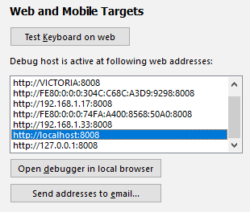
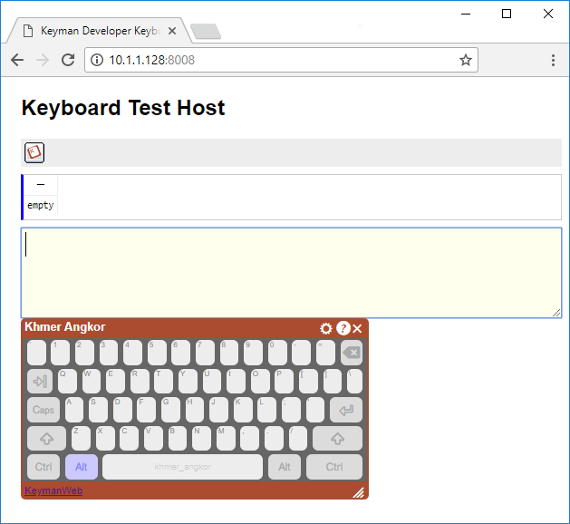
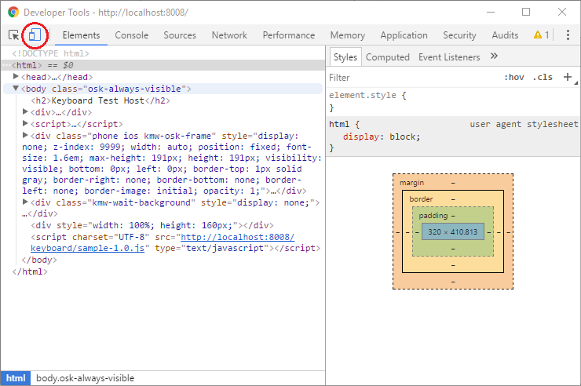
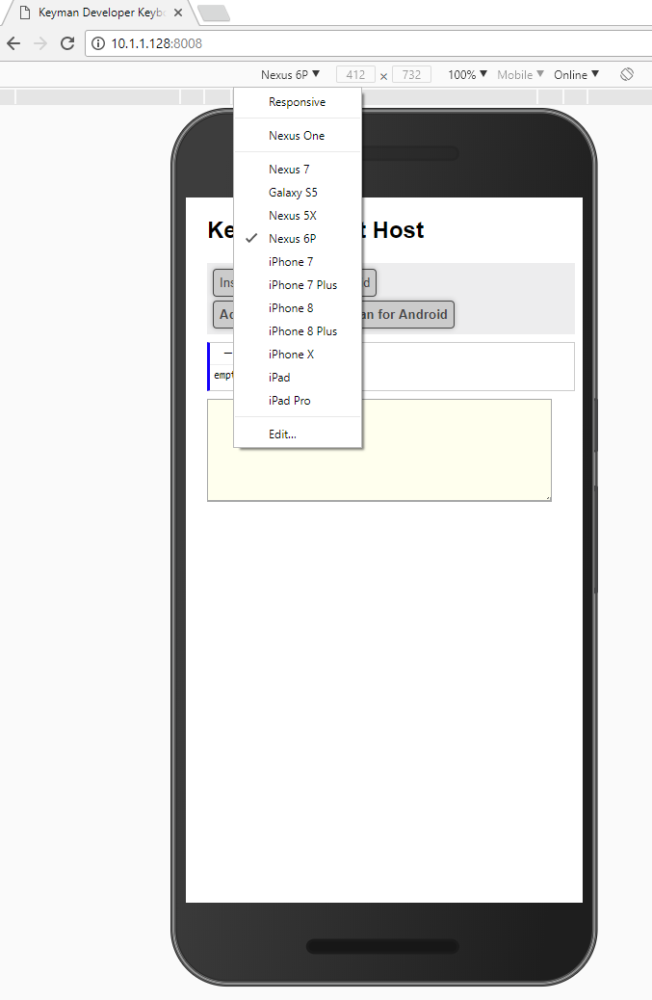
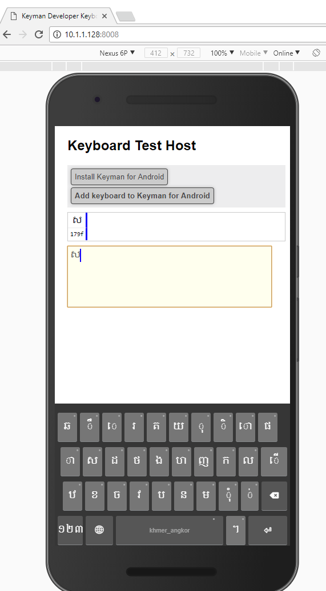

This post builds on knowledge in another article about [testing Keyman
touch layouts](keyboard-touch-and-desktop). Now, we provide an
alternative test platform for your keyboards, running on your desktop
computer rather than your touch device.

Google Chrome includes a mobile emulator for web pages, for various
devices including iPhones, iPads and Androids. Recent builds of
KeymanWeb work well with this emulator and this provides a quicker and
easier way, in many cases, to get a feel for the layout of your keyboard
and do rapid testing.

It is still essential to test your layout on a real device as well as
the emulator: the feel of clicking on keys with a mouse is very
different, and gestures such as longpress menus will feel awkward on the
emulator. We use both native mobile and emulator testing when building
our layouts, switching between the two frequently. Some of the emulated
devices emulated may or not work as well a real device.

## Test Process

1.  Start testing your keyboard with the [original steps on testing
    touch keyboards](keyboard-touch-and-desktop).
    
2.  Open Chrome, navigate to the debug host page for your keyboard, and
    press F12.
    
3.  In the Developer Tools window, click the mobile icon:
    
4.  Back in the debug host page, select the appropriate device from the
    mobile emulation toolbar, then press F5 to reload and enable the
    touch mode. Some recommended devices are iPad or iPad Pro for tablet
    testing, and iPhone X or Nexus 6P for mobile testing. Do not select
    "Responsive".
    
5.  At this point, you should see a simulation of selected device's
    screen, and KeymanWeb should be presenting its touch keyboard rather
    than the desktop equivalent. You'll also see the mouse cursor has
    turned into a fuzzy circle, to simulate a fingertip instead of a
    precise arrow.
    

You can now test the keyboard layout and get an idea of how it will feel
on a real touch device. Rotation, or changing device types will require
a page load (F5) in order to render correctly.

-   [Creating a touch keyboard layout for Amharic - part
    1](../develop/creating-a-touch-keyboard-layout-for-amharic)
-   [Creating a touch keyboard layout for Amharic - the nitty
    gritty](../develop/creating-a-touch-keyboard-layout-for-amharic-the-nitty-gritty)
-   [How to test your keyboard layout — touch and
    desktop](keyboard-touch-and-desktop)

You can distribute your keyboard to other users by following the
instructions in this article:

-   [Distribute keyboards to Keyman
    applications](../distribute/packages)
