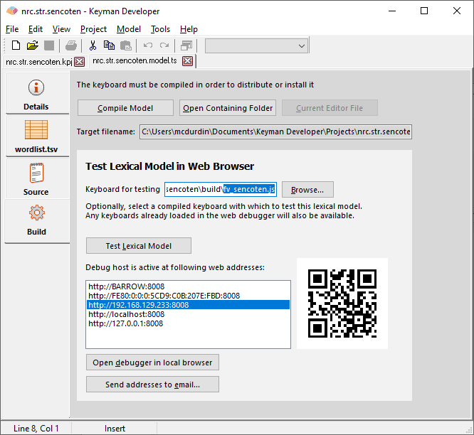

It is helpful to be familiar with processes for testing touch keyboards
before starting to test a lexical model. This tutorial builds on
knowledge found in the following two articles:

-   [Testing keyboard layouts on devices](keyboard-touch-and-desktop)

## Test Process

Lexical models are tested in Keyman Developer's web testing environment.
They can be loaded on any device that can access the testing web site,
in the same way as testing a keyboard layout.

A lexical model must be tested in conjunction with a keyboard. The
keyboard provides the input, and the lexical model will present
suggestions based on that input. In normal use, a lexical model is
linked to a keyboard by the BCP 47 language code with which they are
both registered. However, within the debug environment, any lexical
model can be tested with any keyboard -- but of course an Arabic lexical
model will not provide useful suggestions with a Hindi keyboard, so you
still need a keyboard which will provide sensible input to the model.

There are two ways to load a lexical model in the web-based test
environment:

1.  The first option is to start testing a keyboard as you would, in the
    web test environment. The keyboard will remain available within the
    web test environment until Keyman Developer is restarted, even if
    you switch projects.
2.  The second way is to specify a compiled .js keyboard file for the
    lexical model test to load when you start testing, in the **Build**
    tab of the Lexical Model Editor. This keyboard can be selected once
    and remains saved in your project user settings for future tests.

To start testing a lexical model, follow the steps below:

1.  Ensure the model is compiled by pressing F7 within the lexical model
    editor, or pressing the **Compile Model** button within the
    **Build** tab.
2.  Prepare the associated keyboard for testing as you normally would,
    and load it in the web test environment following the instructions
    above. In the example below, I have selected the fv_sencoten
    keyboard to use during my lexical model test (you may alternatively
    choose to load the keyboard project and start testing from there).
    
3.  Choose the URL in the web addresses list as shown in the image
    above. Keyman Developer lists all the addresses on your computer
    that it can find; some will be addressable by other devices, where
    as addresses such as 'localhost' or '127.0.0.1' are only visible on
    the local computer. Typically, any other device must still be on the
    same network, and you must make sure you allow Keyman Developer
    through your local computer firewall for port 8008 (the default
    debugging port).
4.  Once you start testing, you can swap between models from the
    **Models** menu in the test web page. As you type on the touch
    keyboard, you should see suggestions change in the banner, and you
    should be able to select the suggestions. You can also do the same
    testing in a web browser on a mobile device. Note: you can point
    your mobile device camera at the QRCode on screen to quickly load
    the selected URL on your mobile device.

In order to test the lexical model inside Keyman on a mobile device, you
will need to [prepare the model file for
distribution](../lexical-models/distribute).
