# Keyman Developer  kmc-convert  keylayout -> kmn

## Structure of a keylayout file
A minimal example of a keylayout might look like this:

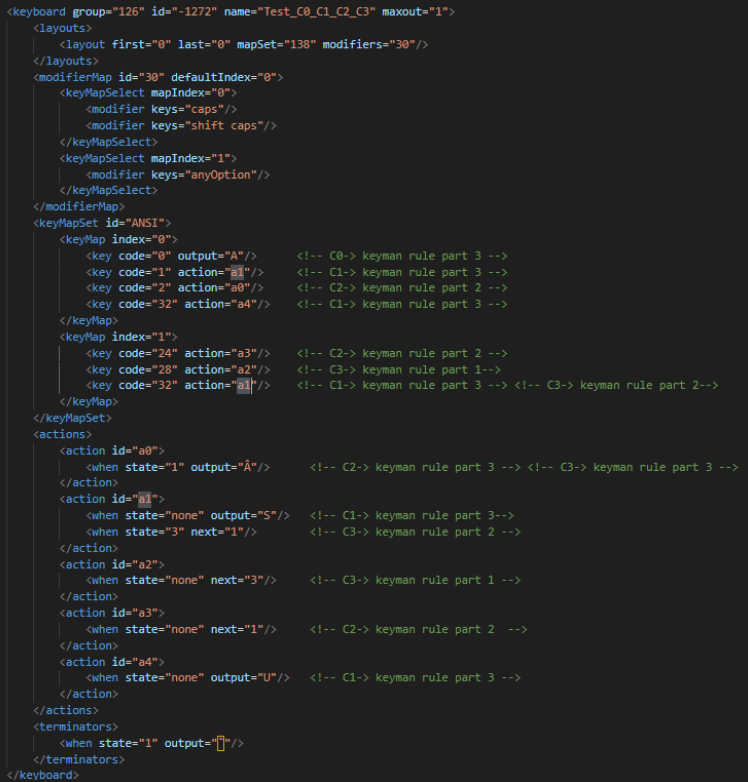
 _<left>structure of a .keylayout file<left>_   

 - A **modifierMap** defines a set of (multiple) behaviours (keyMapSelect)
 - A **keyMapSelect** defines a set of (multiple) modifier combinations. If multiple modifier combinations are defined, they all react in the same way e.g. pressing ‘CAPS’ or ‘SHIFT CAPS’ has the same effect.
 - A **keyMapSet** defines a set of (multiple) keyMap. The number of KeyMapSets corresponds to the number of ModifierMaps.
 - A **keyMap** defines a set of (multiple) keys, their output and their action
Actions define a set of (multiple) action
 - An **action** defines a set of (multiple) state-output or state-next combinations

The sequence of keys, action, and output results in a set of modifier keystrokes that produce an output. Note that kmc-convert can process up to 3 modifier key combinations.

***

# 4 different cases in keylayout-files C0-C3 (minimal examples) 

A .keylayout file may specify a sequence of up to 3 modifiers and keys.
 - We always use a **third** modifier, key and output (blue: C0+C1)
 - We could also use a **third** modifier, key and output following a **second** modifier and key (green+blue:C2)
 - We could also use a **third** modifier, key and output following a **second** modifier and key following a **first** modifier and key (purple+green+blue:C3)

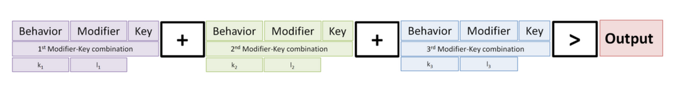
_<left>3 modifier/key combinations of a rule<left>_  

 For a C0 rule keylayout uses 'output' directly.  For C1-C3 rules  keylayout uses 'actions' :

 - C0: modifier/Keycode -> output
 - C1: modifier/Keycode-> action -> output
 - C2: modifier/Keycode-> action -> state:none-next ‘X’ -> state ‘X’ -> output
 - C3: modifier/Keycode-> action -> state:none-next ‘X’ -> state ‘X’ - next ‘Y’ ->  state ‘Y’ -> output
 

###### Note that 1:N relationships may exist in each part of the chain e.g.:
 - One output can be achieved using multiple modifier/Keycode
 - One output can be achieved using multiple actions
 - One action can be achieved using multiple modifier/Keycode
 - One output can be achieved using multiple state ‘X’
 - One state ‘Y’ can be achieved using multiple state ‘X’ - next ‘Y’
   

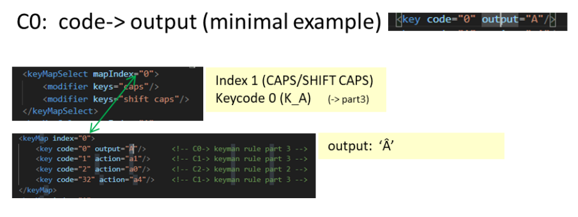
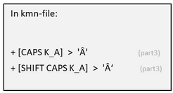
_<left>minimal example C0<left>_     

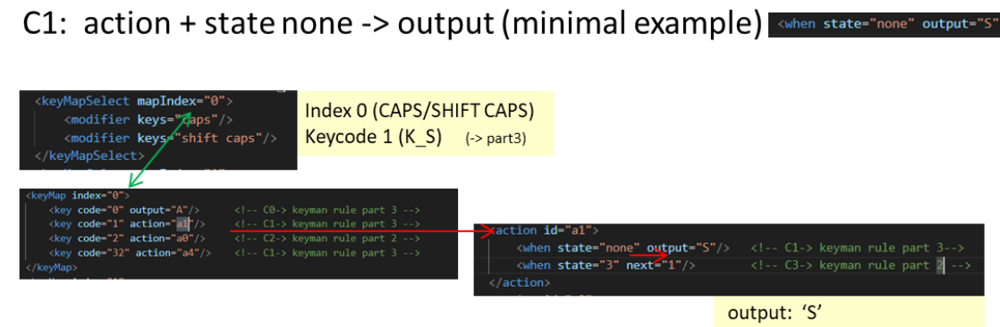
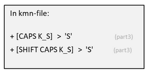 _<left>minimal example C1<left>_     

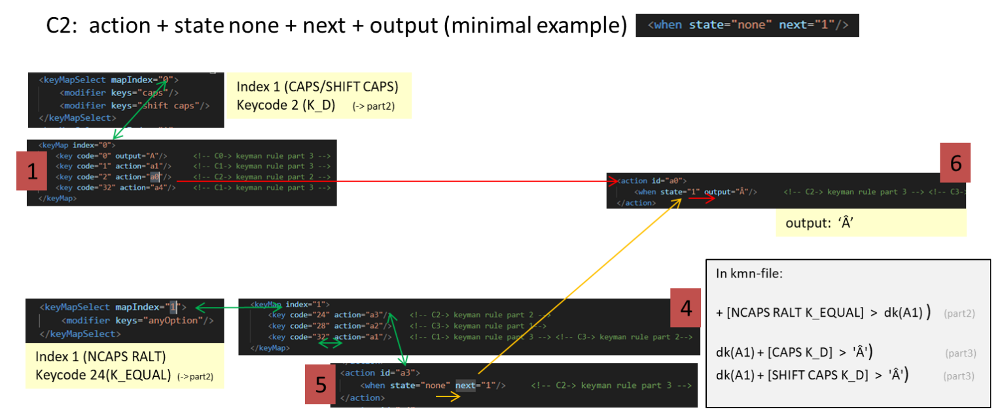  _<left>minimal example C2<left>_
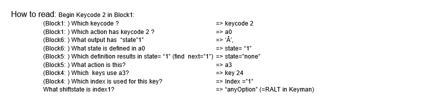  _<left>minimal example C2<left>_     

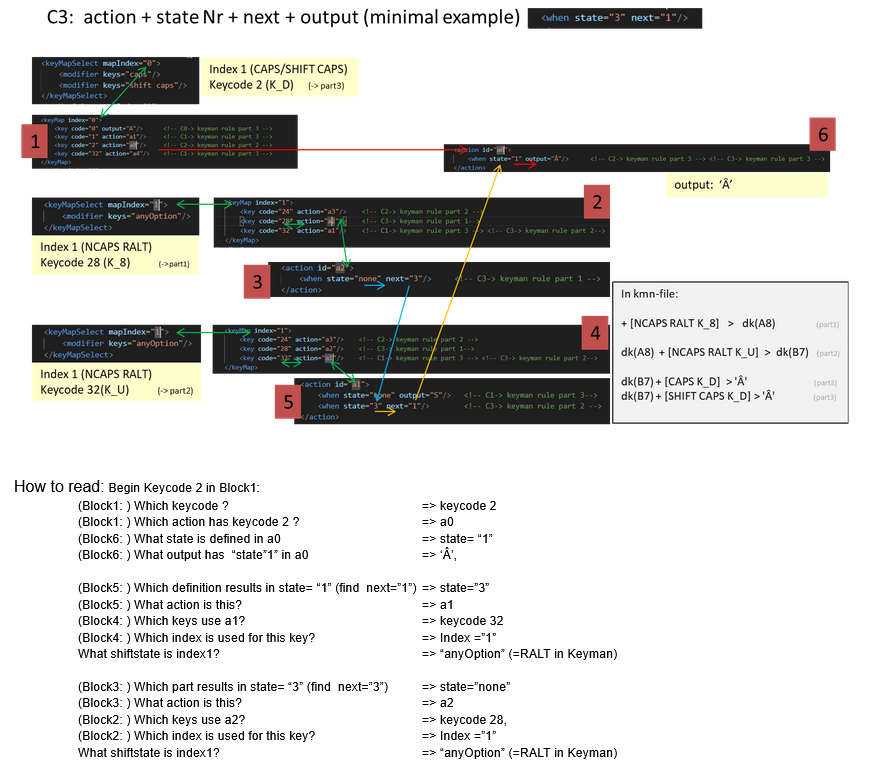
 _<left>minimal example C3<left>_   

***

# Architecture of kmc-convert  (keylayout ->kmn)

### Data is read from a .keylayout file using KeymanXmlReader
At present we use an array of rules to collect all data. In the future this will be replaced by an AST

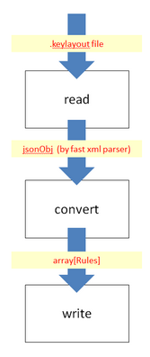
_<left>architecture of kmc-convert <left>_   

***

### Data is converted and stored in a Rule[ ]
After reading data and finding all possible modifier-key combinations specified across the keylayout file we store all those in an array of rules in the way that one element of the array holds data of one single or multiple  modifier-key combination with one output.

If a second or first modifier/key combination is not used the appropriate elements will not contain data

_<left>rule object containing data for all rules<left>_  

In Rule[ ] each “Rule” is an Object and represents a case C0-C4. This ‘Data’ might look like that:

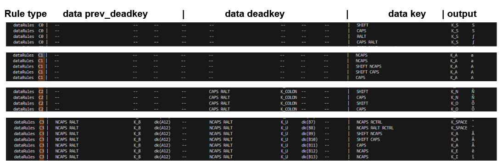
_<left>rule object containing data for all rules<left>_  

Since multiple modifier-key combinations might lead to the same output, several elements might have the same output. 
Also, since each key might be used with several behaviours and we allow multiple modifiers for each behaviour, we easily can get a vast amount of rules.

For example, the character  ‘S’ in a C0/C1 rule of the above example might be achieved with (only) two combinations
 - **SHIFT + K_S**
 - **CAPS +  K_S**

For example, the character  ‘Â’ in a C3 rule of the above example could be achieved through several combinations:
 - NCAPS RALT K_8  	+  NCAPS RALT K_U 	+ SHIFT NCAPS K_A
 - NCAPS RALT K_8  	+  NCAPS RALT K_U 	+ SHIFT CAPS K_A

plus, possible other prev_deadkey and deadkey combinations (not listed above) such as:
 - NCAPS RALT K_8  	+  SHIFT K_U 	+ SHIFT NCAPS K_A
 - NCAPS RALT K_8  	+  SHIFT K_U 	+ SHIFT CAPS K_A
 - CAPS K_8  	+  NCAPS RALT K_U 	+ SHIFT NCAPS K_A
 - CAPS K_8  	+  NCAPS RALT K_U 	+ SHIFT CAPS K_A
 - CAPS K_8  	+  SHIFT K_U 	+ SHIFT NCAPS K_A
 - CAPS K_8  	+  SHIFT K_U 	+ SHIFT CAPS K_A

***
# Data is written to a .kmn file

After obtaining an array of Rule we need to print the rules into a .kmn file. Before printing we need to clean the data i.e. add warning messages, prevent the output of duplicate rules and flag ambiguous rules.
 

# Duplicate and ambiguous rules
### Warning messages

While reviewing and before printing out the new rules into a .kmn file we need to add warnings if needed. These Warnings are written before the respecting rule effectively turning it into a comment. This allows the user to identify potential data conflicts in the kmn file resulting from an incorrect layout of the .keylayout file.

If we find duplicate or ambiguous rules or if we discover an unsupported modifier or a control character we add a comment at the beginning of the line of the .kmn file for example:

 - **c WARNING: unavailable modifier : here: + [NCAPS UNAVAILABLE K_G]  >  'G'**
	if the modifier used is not a suitable keyman modifier
     

 - **c WARNING: use of a control character + [NCAPS RALT CTRL K_G]  >  'U+0007'**
	if we use a control character of less than 'U+0021’
     

 - **c WARNING: ambiguous rule: earlier: [CAPS K_G]  >  'G' here: + [CAPS K_G]  >  '∞’**
	if rules have been defined having same modifier/key but different output or deadkey
     

 - **c WARNING: ambiguous rule: later: [ RALT K_9]  >  dk(A1) here: + [ RALT K_9]  >  '`'**
	if part of one rule is ambiguous with respect to part of another rule.
     

 - **Duplicate rules will not be printed out**
 if we find duplicate rules we print out only one of them

# Duplicate rules

If a rule contains parts which have been defined before, they will be omitted without adding a comment, as Keyman can not process duplicate rules in a .kmn file

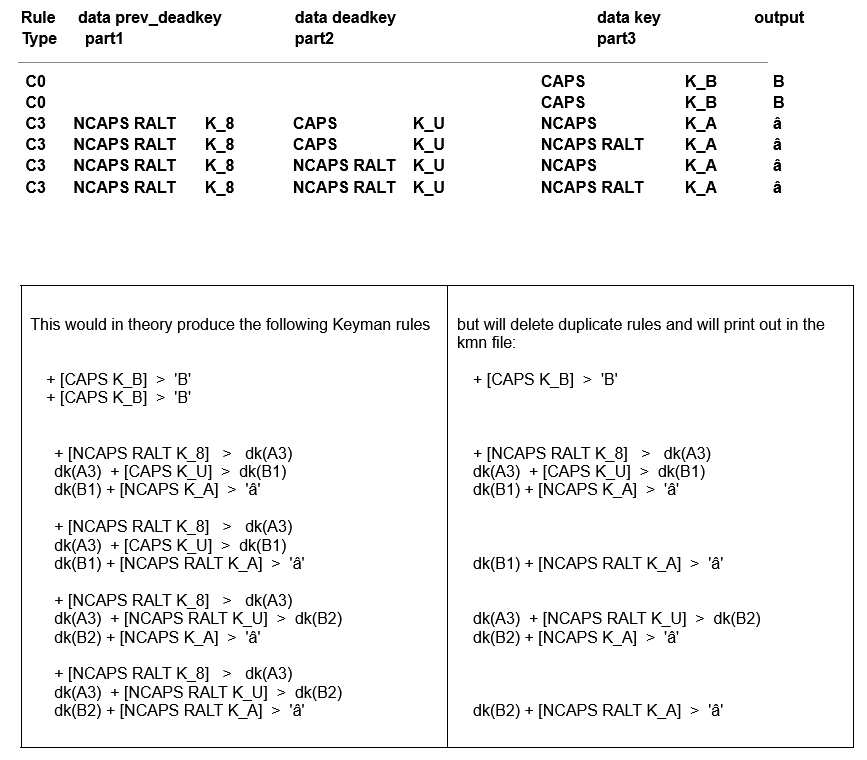
_<left>handling of duplicate rules<left>_  

##### Simply printing each element of the array of Rule would not work since duplicate lines are not allowed in .kmn files:

+***[NCAPS RALT K_8]***   >   dk(A1)
dk(A1)  + **[NCAPS RALT K_U]**  >  dk(B1)
dk(B1) + [SHIFT CAPS K_SPACE]  >  'ˆ'
 

+***[NCAPS RALT K_8]***   >   dk(A4)
dk(A4)  + **[NCAPS RALT K_U]**  >  dk(B4)
dk(B4) + [SHIFT CAPS RALT K_Z]  >  'ˆ'
 

+***[NCAPS RALT K_8]***   >   dk(A29)
dk(A29)  + *[CAPS K_U]*  >  dk(B29)
dk(B29) + [SHIFT NCAPS K_SPACE]  >  'ˆ'
 

+***[NCAPS RALT K_8]***   >   dk(A30)
dk(A30)  + *[CAPS K_U]*  >  dk(B30)
 dk(B30) + [SHIFT CAPS K_SPACE]  >  'ˆ'
 

##### Therefore, we need to structure the output of a .kmn file in the following way:

+***[NCAPS RALT K_8]***   >   dk(A1)
dk(A1)  + **[NCAPS RALT K_U]**  >  dk(B1)
dk(A1)  + *[CAPS K_U]*  >  dk(B29)
 

dk(B1) + [SHIFT CAPS K_SPACE]  >  'ˆ'
dk(B1) + [SHIFT CAPS RALT K_Z]  >  'ˆ'
 

dk(B29) + [SHIFT NCAPS K_SPACE]  >  'ˆ'
dk(B29) + [SHIFT CAPS K_SPACE]  >  'ˆ'
 

### Definition of part1-3 and mod1-6

'Rule' consists of a set of up to 3 modifier/key combinations. We define these as **part1, part2, part3** and abbreviate combinations of modifiers ( e.g. SHIFT CAPS or NCAPS RALT etc.) to **mod1-mod6**.

 - C0 and C1 rules only contain part3 (Text 1)
 - C2 rules contain part2 and part3 (Text 2 and Text 3)
 - C3 rules contain part1-part3 (Text 4 and Text 5 and Text 6)
 

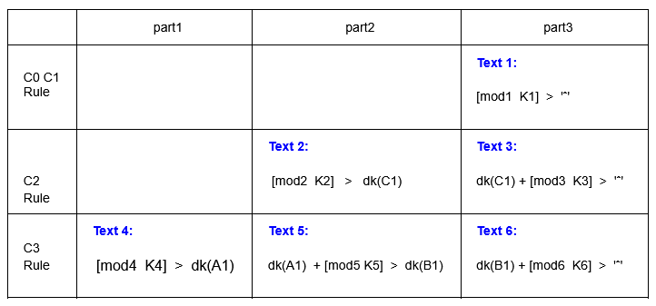
_<left>a rule is made of up to 3 parts<left>_ 
 

# Ambiguous rules

In cases where rules are ambiguous, a warning is displayed before the rule so that the user can decide which rule to apply:

### Ambiguity in C0, C1 rules

In ambiguous rules where only part3 is specified (C0, C1 rules) **we print out the first occurrence** of the ambiguous rule pair (e.g.+ [CAPS K_X]  >  'X' ) and comment out further ambiguous occurrence(s)  (e.g. + [CAPS K_X]  >  'Y' ) since the first occurrence seems to be used more frequently for a keyboard.

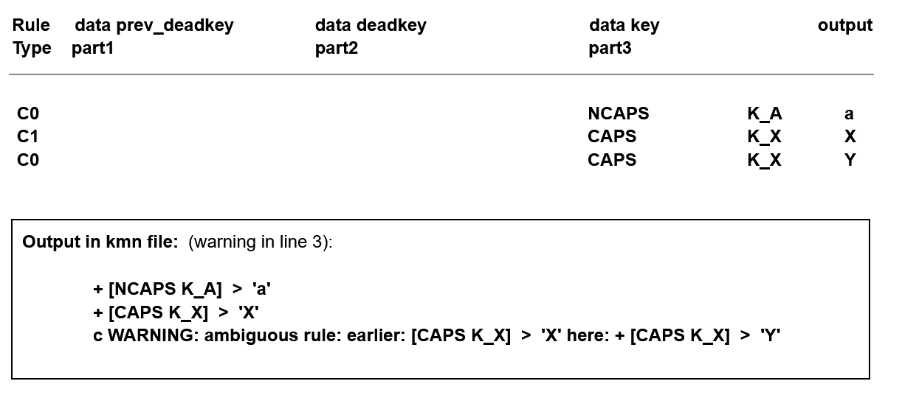
_<left>warning for ambiguous C0/C1 rules<left>_  

### Ambiguity in C2,C3 rules

If a rule has more than part3 specified (= C2 or C3 rule) and part 1 or part 2 of this rule is ambiguous with respect to part3 of a C0/C1 rule, **we use the later occurrence of the ambiguous rule pair** (e.g.  [CAPS K_A]  >  dk(A1)) and comment out the earlier occurrence in the C0/C1 rule ( e.g. + [CAPS K_A]  >  'A' ). 

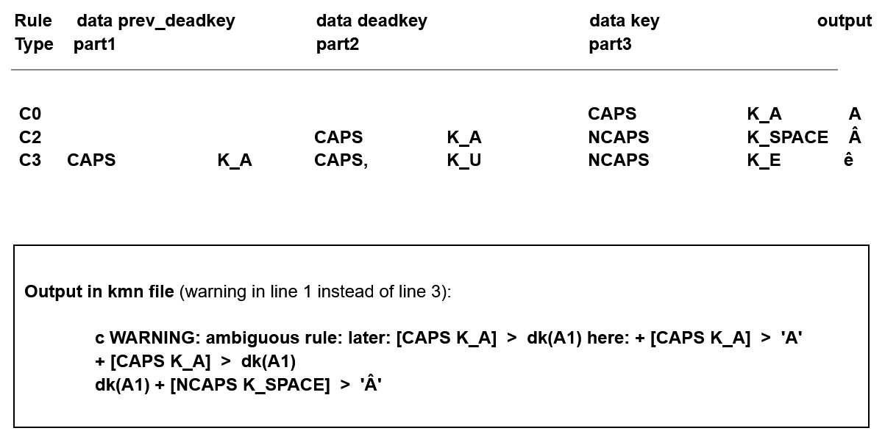
_<left>warning for ambiguous C2/C3 rules<left>_  

This is necessary because it would be pointless to comment out the earlier parts (part 1 or part 2) if part 3 depends on part 1 or part 2. In that case all parts dependent on earlier parts of a rule would be obsolete if the earlier part of that rule would not be available.

***
# Duplicate and ambiguous rules in the code

#### To avoid ambiguous and duplicate rules we need to check the rules before printing

There are several components(parts) of a rule as stated above: part1, part2 and part3. We need to compare those rules in order to detect duplicate/ambiguous rules

We need to check if a rule

 - already exists (**is duplicate**)
        [CAPS K_A]  >  'A'             &emsp;&emsp;   vs.    [CAPS K_A]  > 'A'
        [CAPS K_A]  > dk(A1)              &nbsp;vs.    [CAPS K_A]  > dk(A1)
 

 - Is **ambiguous** to another rule
        [CAPS K_A]  >  'A'                    &emsp;&emsp;vs.    [CAPS K_A]  > 'å'
        [CAPS K_A]  >  'A'                    &emsp;&emsp;vs.    [CAPS K_A]  > d(A1)
        [CAPS K_A]  > dk(A1)              vs.    [CAPS K_A]  > dk(A2)
        [CAPS K_A]  > dk(A1)              vs.    [CAPS K_A]  > dk(B1)

 

##### The following comparisons will need to be made:

 - Text1 vs. Text1    for   *ambiguity* 	(C0/C1 rules)
 - Text1 vs. Text1    for   duplicity 		(C0/C1 rules)
 - Text1 vs. Text2    for   *ambiguity* 	(C0/C1 +C2 rules)
 - Text1 vs. Text4    for   *ambiguity* 	(C0/C1 +C3 rules)
 - Text2 vs. Text2    for   *ambiguity* 	(C2 rules)
 - Text2 vs. Text2    for   duplicity 		(C2 rules)
 - Text2 vs. Text4    for   *ambiguity* 	(C2 +C3 rules)
 - Text3 vs. Text3    for   *ambiguity* 	(C2 rules)
 - Text3 vs. Text3    for   duplicity 		(C2 rules)
 - Text3 vs. Text6    for   *ambiguity* 	(C2 +C3 rules)
 - Text3 vs. Text6    for   duplicity 		(C2 +C3 rules)
 - Text4 vs. Text4    for   *ambiguity* 	(C3 rules)
 - Text4 vs. Text4    for   duplicity 		(C3 rules)
 - Text5 vs. Text5    for   *ambiguity* 	(C3 rules)
 - Text5 vs. Text5    for   duplicity 		(C3 rules)
 - Text6 vs. Text6    for   *ambiguity* 	(C3 rules)
 - Text6 vs. Text6    for   duplicity 		(C3 rules)

