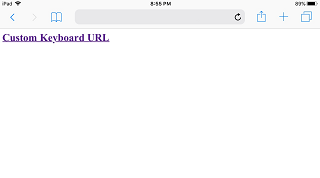
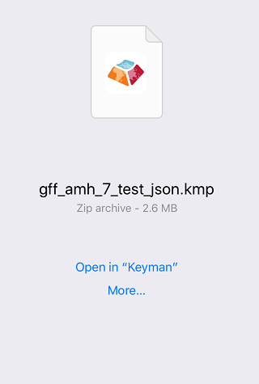
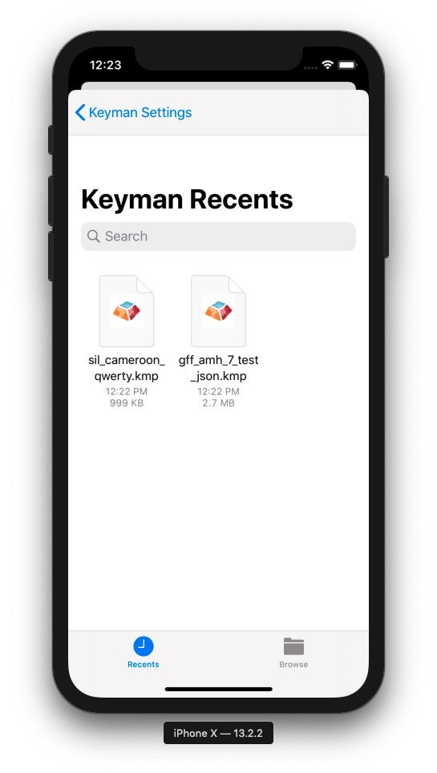

The following steps can be used to install either a keyboard package or a dictionary package.

### Download the File
If downloading a custom keyboard from the internet, click the link to your custom keyboard package file.

For this example, we'll install a custom keyboard from a link in Safari.  Our example keyboard is for the GFF Amharic 7 keyboard.

Safari will display an option to open the KMP file with Keyman.

Click **Open in "Keyman"** to continue.

### Finding the File (iOS 13+ only)
Installation is also possible from email clients and other sources.
Once you download the file and save it to your device, look for an
**Open in "Keyman"** option or use the
Install From File option in Keyman seen below.

Once this option is selected, a file browser will appear.  By default, it will show the most
  recently downloaded files that can be installed.

If you have difficulty finding the right file, consider using the **Browse**
option at the bottom-right.  Once you select it, you should then be greeted with the screen shown in
the section below.

### Installing the Package

Whichever option you take, the app will launch and prompt you with the keyboard's installer.

[Follow this link to continue.](../start/installing-packages)