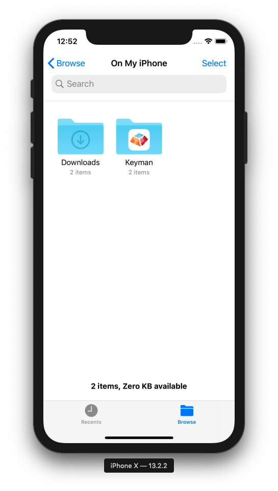
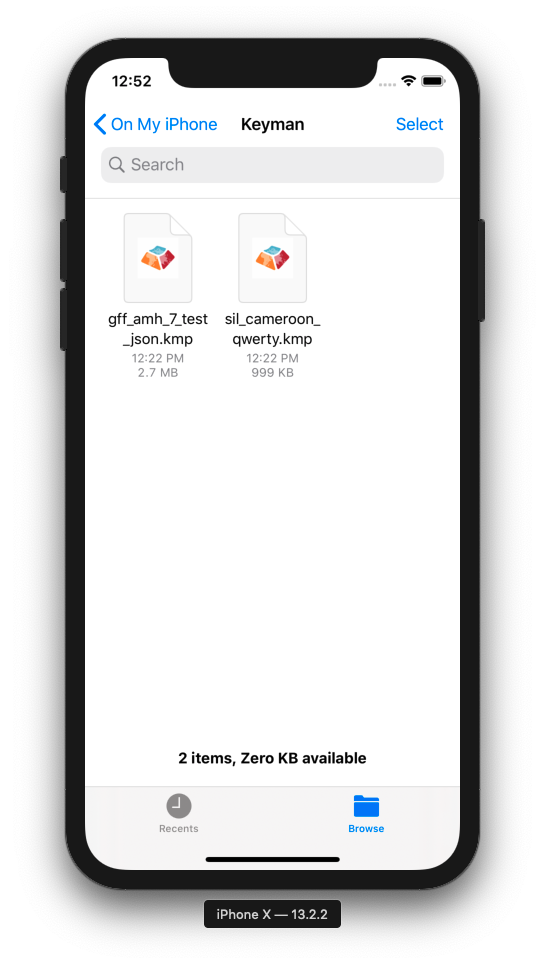
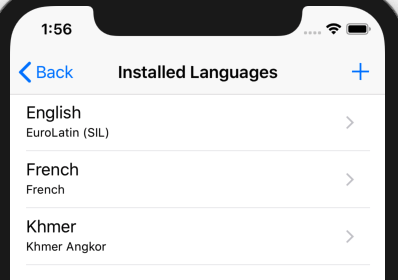
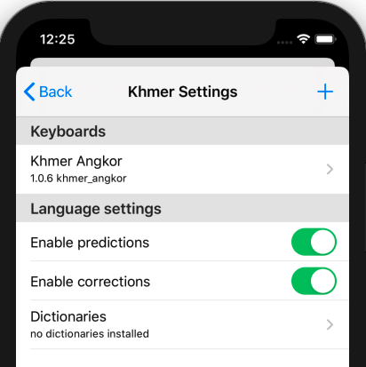
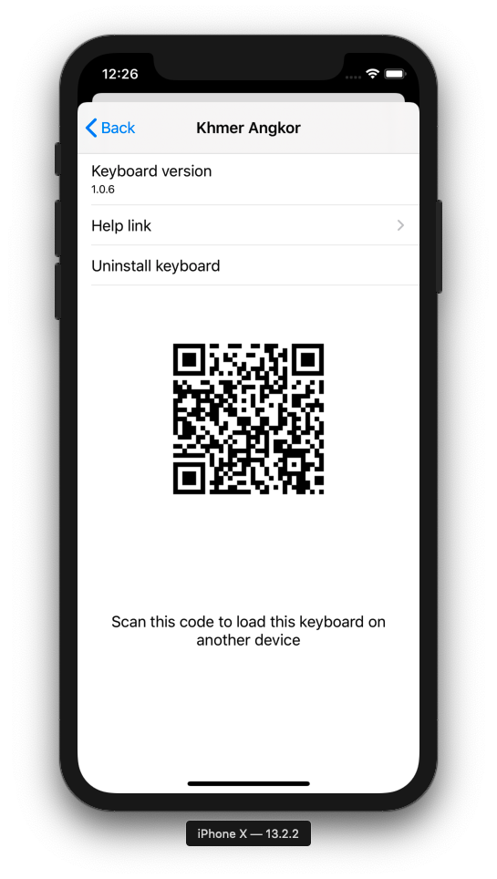
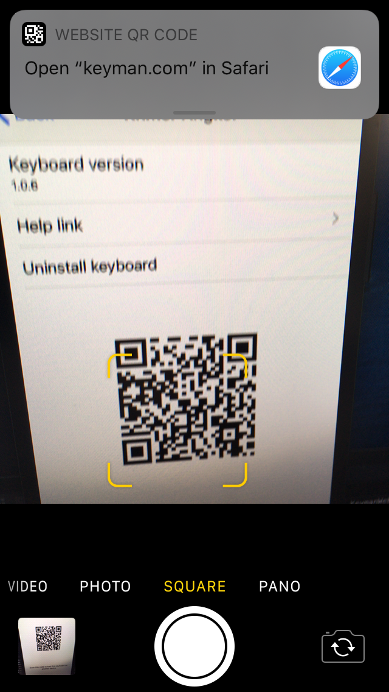
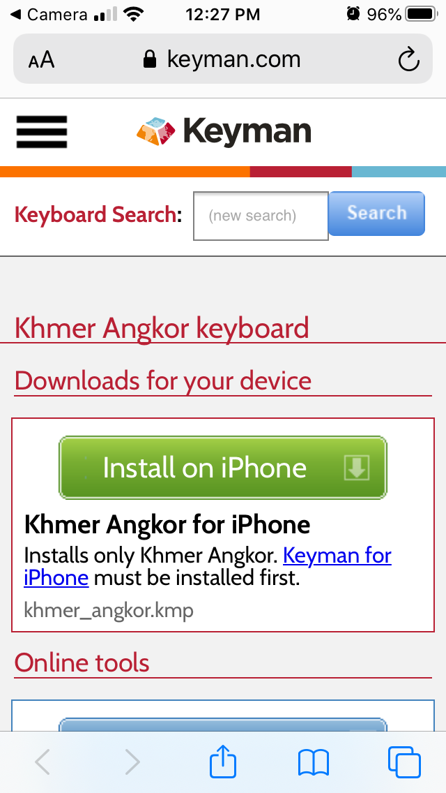

### Sharing Options
There are two supported ways to share keyboards and dictionaries:

1. By file
    - You may copy and send the `.kmp` package containing the keyboard or dictionary to someone else.
2. By QR code
    - You may show someone else a QR code that links directly to the package's download page.

### Sharing via File
Whenever you install a keyboard or dictionary from a file, Keyman makes a packaged copy of it on your device.  You can find these copies in the iOS Files app.

Simply select the "Keyman" folder to view these files.

From here, longpress the file for the keyboard or dictionary you wish to share, then
click **Share** to view sharing options.

For installing this file on another device, you may wish to read [Installing custom keyboards/dictionaries](installing-custom-keyboards-dictionaries).

### Sharing via QR code
For keyboards and dictionaries downloaded directly through the app,
you can provide friends with a scannable QR code.  First, find the resource
through the Settings menu under Installed Languages.

When you select the keyboard, a page like the following should appear:

Note that QR codes are only provided for keyboards and dictionaries
that are distributed by Keyman.

### Installing from QR code
To install from QR code, simply launch your device's Camera app and point
it at the code, as seen below.

Selecting the notification seen at the top will lead you to the following page:

Selecting the big **Install on iPhone** (or **Install on iPad**) option will then download
the file for easy installation.  (Refer to [Keyboard and Dictionary Installation](../start/installing-packages) for more information about installation.)
