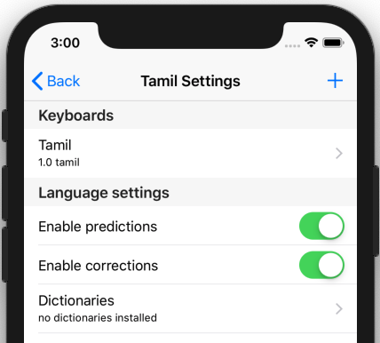
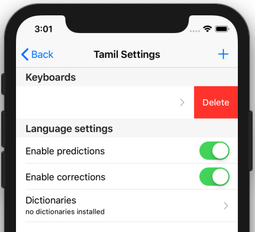

To uninstall a keyboard, follow these steps.

### Access "Installed Languages"
First, open the "Settings" menu.

The "Installed Languages" menu found here manages your installed keyboards and dictionaries.

You should then see the following screen:

### Removing the Keyboard
Start by selecting the language for the keyboard you wish to uninstall.

Swipe left on the keyboard you want to remove.  You'll see a button to **Delete**.

Click the **Delete** button to uninstall the keyboard.
