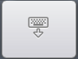
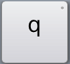
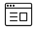

[Keyboard gestures](gestures)

|    | Keyboard Keys  (Keyboard Present) |
|---|---|
|  | Install or select another language/keyboard |
|  | Hide the keyboard |
|  | Backspace |
|  | Return |
|  | Shift key. Long press this key to access the <kbd>CTRL</kbd>, <kbd>ALT</kbd> and <kbd>CTRL</kbd><kbd>ALT</kbd> keys (which can access additional key layers) |
|  | Keys with a small dot in the top right corner indicate a long press key. Access further functionality by long pressing the key |

----

|    | Toolbar Icons </th>
|---|---|
|  | Share your text via Mail, Text, Facebook or Twitter |
|  | Open the Keyman Browser |
|  | Open the menu for additional options |
|  | Adjust the font size |
|  | Delete all current text |
|  | Open the initial setup screen |
|  | Load the Keyman help page |
