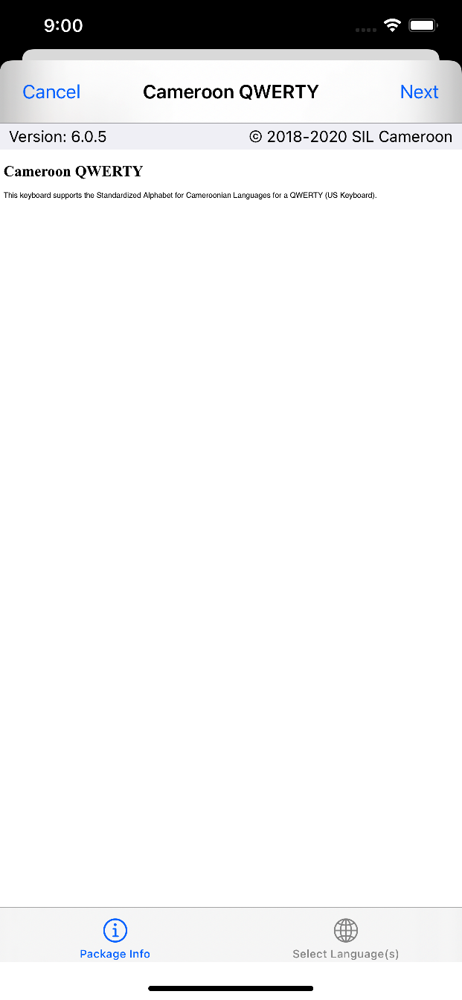
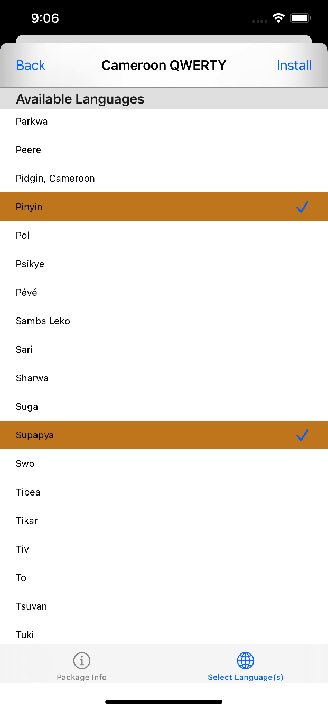
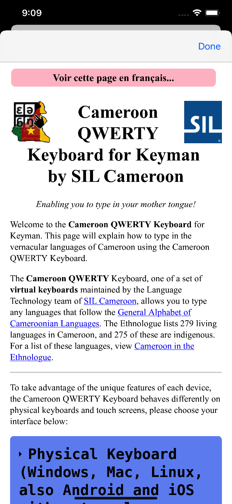
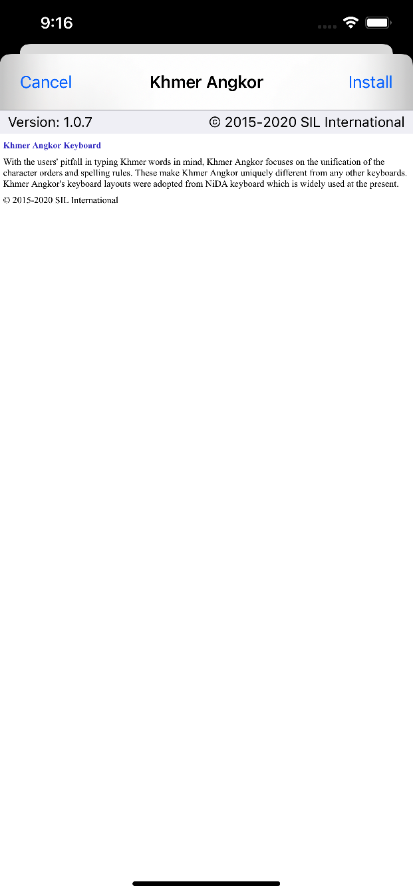
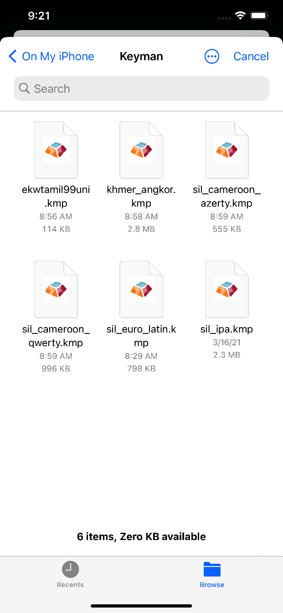

The following steps can be used to install either a keyboard package or a dictionary package.

### Installing the Package

Whenever a keyboard or dictionary installation begins, the following screen will be displayed:

The bar at the bottom is only displayed when installing keyboard packages supporting multiple languages.  Selecting either "Select Language(s)" at the bottom-right or "Next" at the top-right
will continue the installation process.

You may then choose any number of supported languages to pair this keyboard or dictionary with.  When installing keyboards, the app will automatically search for available dictionaries matching the languages you choose.

Once satisfied with your selections, click the **"Install"** button at the top right.

The package's documentation will then be displayed while installation (including any background dictionary searches) continue in the background.  Click "Done" to finish installing your keyboard or dictionary.

### Other notes

Note that on tablets, the first two screens above will be combined into a single screen.  Furthermore, if installing a keyboard that only supports a single language, the second screen will not appear:

Once installation is complete, the app will automatically save a backup copy of your newly-installed package.  You may find it within the app's folder in the Files app, and it may be deleted safely.  This file may also be sent to other devices in order to share the keyboard or dictionary package with other people.

To learn how to create a custom installable keyboard or dictionary, [click here](http://help.keyman.com/developer/current-version/guides/distribute/).
