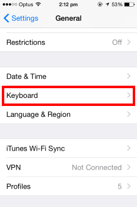
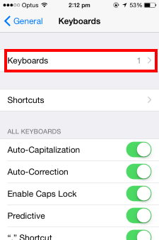
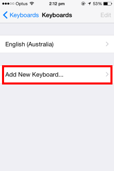
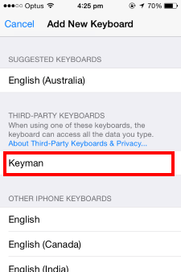
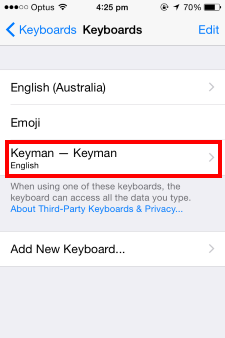
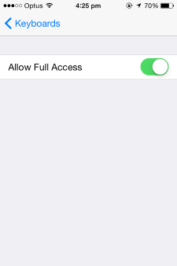

Open the 'Settings' App and go to 'General' > 'Keyboard'.

Touch 'Keyboards'.

### Enabling Keyman
To activate Keyman as a system keyboard, touch 'Add New Keyboard...'

Touch 'Keyman' under THIRD-PARTY KEYBOARDS.

Touch 'Keyman - Keyman'.

Turn on the 'Allow Full Access' toggle and confirm.

Your Keyman keyboards will now be available throughout your entire device. You can switch between Keyman keyboards and 
the default iOS keyboard layout by touching the globe key of the keyboard whenever you are typing.

### On "Allow Full Access"
An issue with iOS 16 causes the Keyman system keyboard to not display unless "Allow Full Access" is enabled. Until the issue is addressed, this setting must be left in the on position for Keyman to operate normally.

For normal use of Keyman with versions prior to iOS 16.0, there is no need to keep "Allow Full Access" enabled. It is needed only for making changes to some keyboard preferences.

