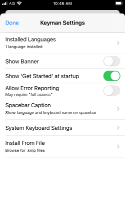
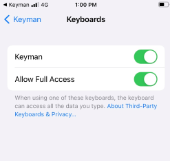

## Using the Settings Screen

This Settings screen is used to configure keyboards and dictionaries.
It also has many of the options that are available on the 'Get Started' menu. To access the Settings screen:

Step 1)
Open the Keyman app.

Step 2)
Click the ellipsis (...) for additional options. Select 'Settings'

Each selection on the Keyman Settings screen is described in further detail below:

## Installed Languages
This displays the number of installed languages. Click this line for the 'Installed Languages'
screen where you may view the languages you have installed and, by clicking any one language, find its keyboards and dictionaries along with [more settings](../language-settings).

Click on this to [search for a keyboard or language](../../start/searching-for-keyboards).

## Show "Get Started" on startup
When enabled, the Keyman app will display the 'Get Started' screen on app startup.

## Allow error reporting
When enabled, the Keyman app will send crash reporting information to https://sentry.keyman.com. No personally identifiable information or keyboard strokes are recorded.

## Spacebar Caption
Click on this to [change the displayed keyboard name](spacebar-caption) on the spacebar.

## System Keyboard Settings
By default, installed Keyman keyboards are only available to use within the Keyman app. Click on this setting to
bring up the iOS system configuration so Keyman can be added as a system-wide keyboard.

## Set Keyman as default keyboard
Select 'Keyboards' to bring up the iOS system configuration for setting Keyman as the default system-wide keyboard. Toggle both 'Keyman' and 'Allow Full Access'.

## Install From File
Select this to browse the files on your device and install a keyboard from a .kmp file.

