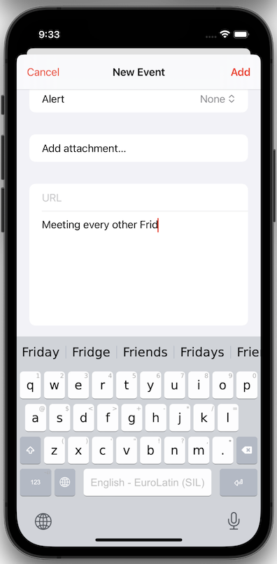
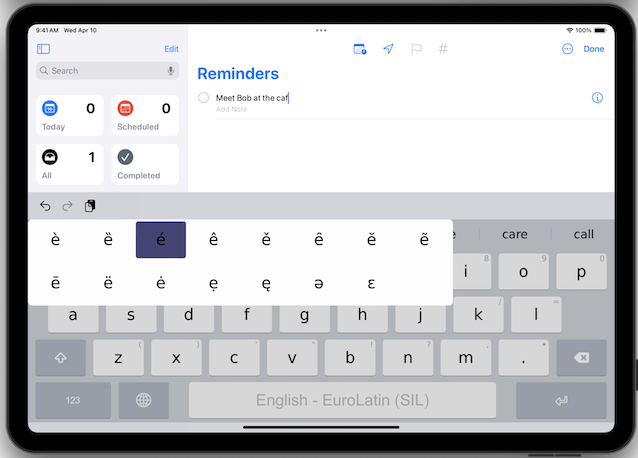

Keyman keyboards are accessed by pressing the globe key whenever an iOS app presents the system keyboard. The following screenshot shows the Keyman EuroLatin keyboard displayed with Apple's Calendar app.

### Using Gestures on the Keyboard Keys

Gestures provide ways to interact with the keyboard to produce different text output. Which gestures are available varies depending on the design of the individual Keyman keyboard. 

**Note:** a dot or a small letter in the upper right corner of a key is a hint to indicate that the key supports flick, long press or multitap.

The Gestures:

* **Tap:** Tap on a character key to cause the associated character to be output to the app.

* **Long press:** Press and hold a key, and after a moment a submenu will appear. Continue holding the key and slide to the submenu to select a key. Release, and the selected key from the submenu is output. A key submenu is shown in the following screenshot.

* **Flick:** hold and slide in various directions on a key to reach alternate outputs. The key will animate to show you the expected output. For example, a keyboard could support sliding down on keys in the top row to output numerals.

* **Multitap:** some keys produce alternate outputs with rapid, repeated taps. For example, tapping rapidly twice on <kbd>shift</kbd> will activate <kbd>caps lock</kbd> on many keyboards.

