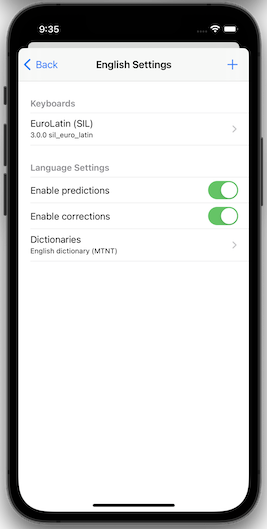
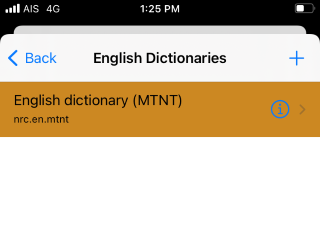

### Access "Installed Languages"
First, open the "Settings" menu.

The "Installed Languages" menu found here manages your installed keyboards and dictionaries.

You should then see the following screen:

### Select a Language to View its Settings
After selecting a language, you will find settings in these categories: Keyboards, Language Settings, and Dictionaries.

### Keyboard Settings
In Keyboard settings, you will find a list of keyboards installed in the language. After clicking a keyboard, you will see

* the version of the installed keyboard
* the link to the 'Keyboard help' screen with information about its symbols and fonts
* the option to Uninstall the keyboard
* the QR code for loading this keyboard on another device

### Language Settings
In Language settings, you may see

* the option to enable predictions
* if predictions are enabled, the option to enable corrections

These predictions and corrections are given while a user types, based upon the dictionary selected under 'Dictionaries'.

### Dictionaries
In Dictionaries, you will see a list of dictionaries installed for the language.

Click this to select a new dictionary from a list of available dictionaries in the language.

Back in the dictionaries list, after clicking a dictionary, you will see its name again, along with a blue information icon:

After clicking the 'i' icon, you will see

* the version of the installed dictionary
* the option to Uninstall the dictionary

