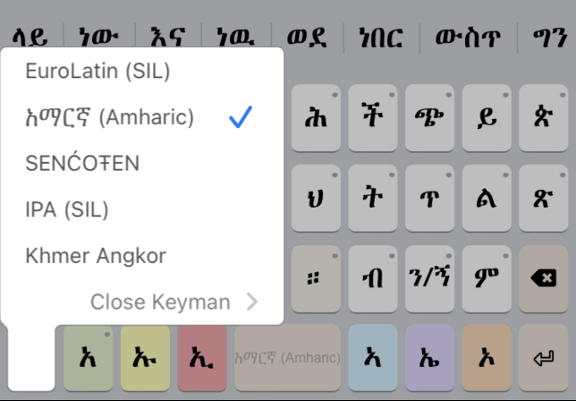

Keyboard switching is always activated by using the following key:

  This will bring up a list of all currently installed languages (the default is English USA). If you have already downloaded additional languages, they will appear here. Simply select them and the keyboard will re-appear with the new language.

### The In-App Menu

Simply select any keyboard to activate it and return to the previous screen.

### The System Keyboard Menu

This menu only displays when the 'globe' key is touched and held.

The "Close Keyman" option will activate the next available non-Keyman system keyboard.

A quick tap on the "globe" key will instead transition to the next available installed keyboard
without displaying the menu.
