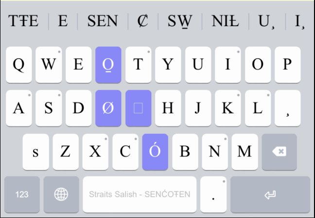
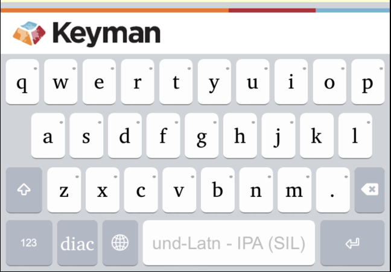

## About the Keyboard Banner

Keyman keyboards now always display a banner above the keyboard for one of the following functionalities:

* Display suggestions (See "Using the Suggestion Banner" below)
* Display a Keyman-themed banner so popups and gestures for the top row of keys are visible
* Reserved for future functionality

## Using the Suggestion Banner

If a [dictionary is installed](installing-custom-keyboards-dictionaries) and enabled for the active Keyman
keyboard, the banner will display suggestions that can be selected.

* Drag the banner horizontally to see more suggestions
* Overly-long suggestions are partially hidden, but expand when a finger is held on them
* The banner will display up to 8 suggestions at a time.

## The Keyman-Themed Banner

When suggestions are disabled or unavailable, the Keyman-themed banner will display instead.
This is displayed so that key-popups and gestures for the top row of keys are visible.

