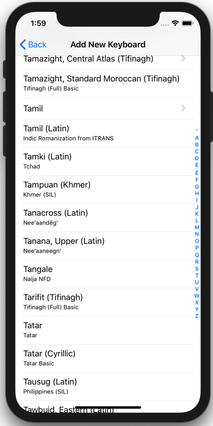

To install resources for use with a new language, follow these steps.

### Access "Installed Languages"
First, open the "Settings" menu.

The "Installed Languages" menu found here manages your installed keyboards and dictionaries.

You should then see the following screen:

### Finding Your Keyboard
Click the **+** at the top-right to open the keyboard catalog.

From there, select the language and keyboard you want to install.

A list of all available languages will appear. Scroll through this list until you find the language you want to install. 
Some languages may have multiple keyboards - for example we have 10 different Tamil keyboards.

A popup will then ask for confirmation.  Hit the **Download** button.

The new keyboard will then be installed and available for use.
