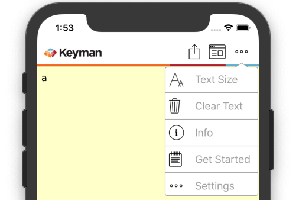
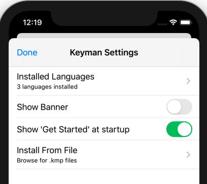
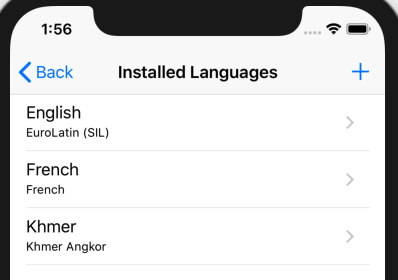
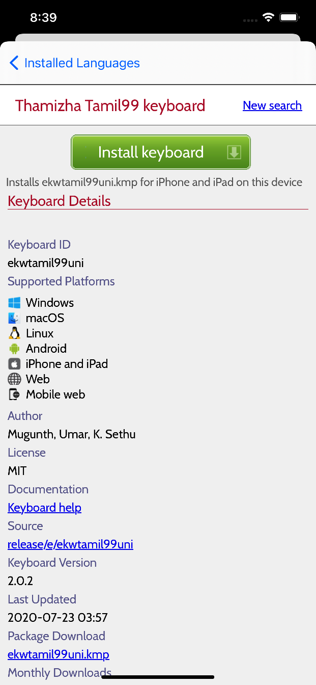

To install resources for use with a new language, follow these steps.

### Access "Installed Languages"
First, open the "Settings" menu.

The "Installed Languages" menu found here manages your installed keyboards and dictionaries.

You should then see the following screen:

### Finding Your Keyboard
Click the **+** at the top-right to open the keyboard catalog.  This will launch a search page.  You may type in the (English) name of your language, your country, or even a specific keyboard.

A list of keyboards matching your search will be listed. Selecting one will result in the following screen:

Clicking the big green "Install Keyboard" button will download and install the keyboard.

Once you click the "Install" button, you will then be prompted with the keyboard's installer.

**Learn more about [Keyboard and Dictionary Installation here.](installing-packages)**

### Keyboard Documentation

If you would prefer to learn more about the keyboard before installing it, look for this link on the same page:

This link will open in your preferred browser, allowing you to easily return the installation page once satisfied.

