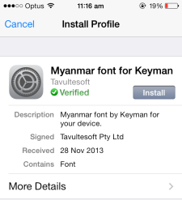
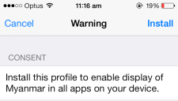
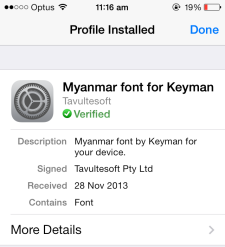

Some keyboards require special fonts that do not come standard with your iPhone or iPad. 
For keyboards that use these fonts, the Keyman app will provide a download of the font to install onto your device, 
meaning all apps will be able to correctly display the font. To install the font, touch **Install**.

You will then be taken to your device settings, and asked to install a profile for the font. Touch **Install**.

Then Install again in the Consent page.

Once the profile is installed, touch Done.

And then Touch now to return to Keyman.

The font is now successfully installed, and will display correctly throughout your device!
