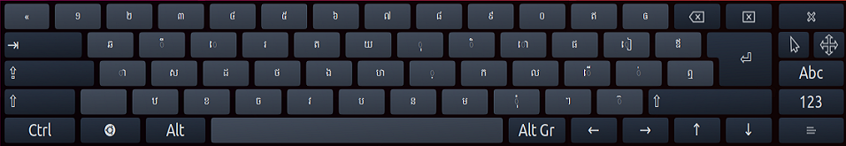

See also [Knowledge Base articles](https://help.keyman.com/knowledge-base/).

## Q. How do I install Keyman for Linux?

**A.** In Ubuntu and Wasta-Linux, Keyman for Linux can be installed via launchpad:

```bash
sudo add-apt-repository ppa:keymanapp/keyman
sudo apt-get update
sudo apt-get upgrade
sudo apt-get install keyman onboard-keyman
```

An older version of Keyman for Linux packages is also available in any current Debian at:
[https://packages.debian.org/keyman](https://packages.debian.org/keyman)

**Note** in order to fully work you'll need a patched version of ibus
which is available in the above launchpad repo. Patched versions of ibus
will have the string `sil` in the package version number.

## Q. How do I install a Keyman keyboard?

**A.** Follow this [guide](../start/installing-keyboard) for installing Keyman keyboards.

## Q. What's the relationship between Keyman for Linux and KMFL?

**A.** KMFL is no longer actively developed and no longer distributed with
Keyman 17.

KMFL was developed as a black-box clone of Keyman for Windows years ago; after
Keyman was released as open source it became possible to share the
code base between Windows and Linux. Keyman for Linux is the long-term
supported solution.

## Q. If I already had KMFL installed, how can I uninstall KMFL before installing Keyman?

**A.** It is good to remove any keyboards from ibus e.g. KMFL keyboards before you remove KMFL.
Then, to remove KMFL:

```bash
sudo dpkg --purge ibus-kmfl libkmfl
```

## Q. How do I display the On-screen Keyboard (OSK)?

**A.** From the launcher, enter `onboard`



Unfortunately `onbboard` only works with X11, not with Wayland. Currently there's
no on-screen keyboard for Wayland that works with Keyman.

## Q. What Linux distros will Keyman work with?

**A.** Keyman runs on Debian, Ubuntu, Wasta Linux and can be compiled to run
from source in most distributions.

**Note:** Ubuntu versions before Ubuntu 20.04 LTS are no longer supported with
Keyman 17. If you are still running an older version and require Keyman you'll
have to install an older Keyman version.

## Q. Will my existing Windows Keyman keyboard work with Keyman for Linux?

**A.** Most keyboards will work without change. A small subset of keyboards
require features which are not yet available in Keyman for Linux. These
features will be progressively implemented.

## Q. How can I disable automatically reporting errors?

**A.** If Keyman crashes, it will automatically send a report to the development
team. This report is anonymous and contains only technical details relating to
the crash. It does not include keystroke data or personally identifying data. If
you don't want these automatic error reports to be sent you can disable the
checkbox in the Options in Keyman Configuration, or you can set the
environment variable `KEYMAN_NOSENTRY` and start `km-config` from
the command line:

```bash
export KEYMAN_NOSENTRY=1
km-config
```
