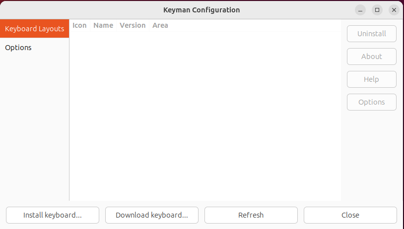
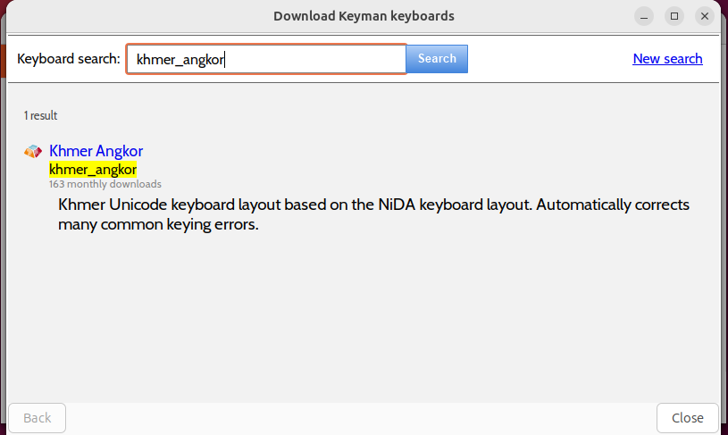
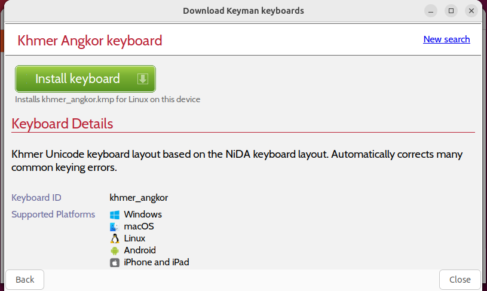
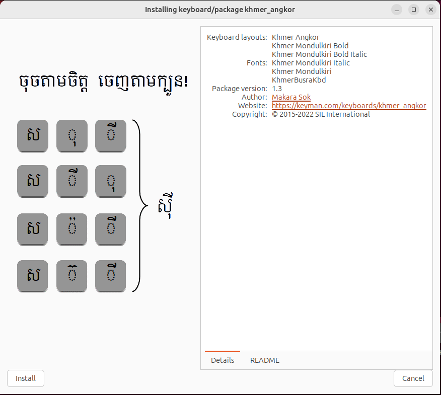
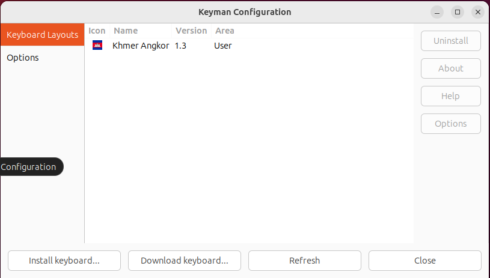
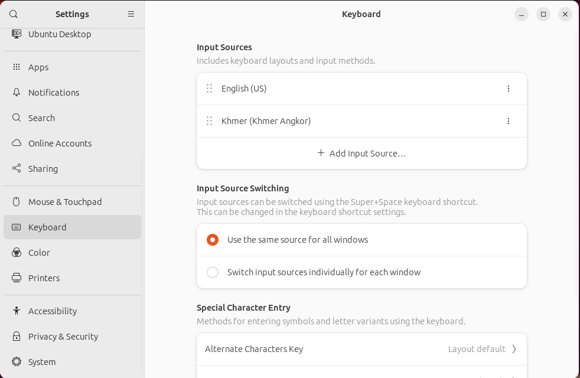

Keyboards are installed with Keyman Configuration. From the launcher, enter `Keyman Configuration`.
Alternatively from the command line run `km-config`.

## Download from Keyman cloud repository

From Keyman Configuration, click "Download". At the search page, enter the keyboard you want to download.

Clicking the keyboard brings the keyboard page which has a link for installation.

## Install Local .kmp keyboard package

Keyman for Linux can also install keyboards from local .kmp keyboard packages. From Keyman Configuration,
click "Install". Then browse to the local .kmp keyboard package and install.

The keyboard should appear in Keyman Configuration.

Your input source is now accessible in IBus. Use the shortcut Windows-spacebar to switch input source.

