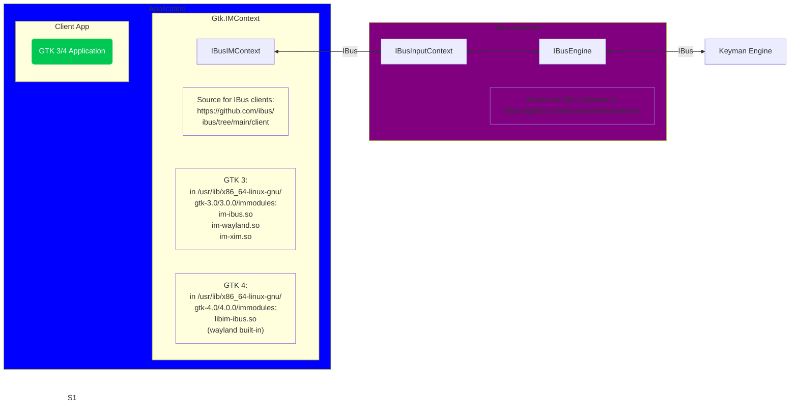

# Input Methods in GTK

This document describes how Keyman is connected to a client app, in other words
how a keypress in the app ends up being processed by the Keyman engine.

For text input, GTK (or rather the app) will add input method support to a widget.
How the input method gets loaded depends on the GTK version.

IBus provides input modules for GTK 2, GTK 3, GTK 4, X11, and Wayland.
However, the Wayland one is not used with Gnome because GTK provides
its own implementation.

Which input modules are available depends on the GTK version. Apps that
don't use the Gnome/GTK framework use different ways for input method
support.

## GTK 4

The im-module implements a [GIOExtensionPoint](https://docs.gtk.org/gio/struct.IOExtensionPoint.html)
"gtk-im-module". The type extends `GtkIMContext`.
When loading the app, GTK dynamically loads and starts the extension
specified by the environment variable `GTK_IM_MODULE` (or the default which is
probably the one with the highest priority).

External modules are located in `/usr/lib/x86_64-linux-gnu/gtk-4.0/4.0.0/immodules`
and named `lib*.so`.

Each module has a priority, a name and the type that implements it.

GTK4 has built-in support for Wayland (`GtkIMContextWayland`), Broadway
(`GtkIMContextBroadway`, irrelevant for Keyman) and gtk-im-context-simple
(`GtkIMContextSimple`, irrelevant for Keyman). `GtkIMContextWayland` is
implemented as part of GTK 4, the source code can be found in
<https://github.com/GNOME/gtk/blob/main/gtk/gtkimcontextwayland.c>.

The input method for ibus is implemented as an external module
(type `IBusIMContext`). Source code is in
<https://github.com/ibus/ibus/tree/main/client/gtk4>.

The IBus communication between `IBusIMContext`, ibus-daemon and the ibus
engine (aka Keyman) happens with DBus messages on a separate IBus DBus
instance.

## GTK 2/GTK 3

With older GTK versions basically the same components are involved,
although a different mechanism to discover and load the
im-modules is used.

GTK caches the available modules in a module database located in
`/usr/lib/x86_64-linux-gnu/gtk-3.0/3.0.0/immodules.cache` or whereever
the `GTK_IM_MODULE_FILE` environment variable points. This database is
read on application startup.

For each module the database contains an id, the name, the path, i18n domain(?)
and default locales.

GTK then determines what input module to load based on the `GTK_IM_MODULE`
environment variable (which can contain more than one module separated by
colons)  or the `XSETTINGS` `gtk-im-module` property. It then checks that
the currently running display type is compatible with the module, and that
the current locale matches the locales supported by the module. An exact match
(`en_US` vs `en_US`) gets 4 points, a match of the language (`en_US` vs `en`)
gets 3 points, a match with a different region (`en_US` vs `en_UK`) 2 points,
and a wildcard (`en_US` vs `*`) 1 point.

Each input module implements a subclass of `GTKIMContext` plus the 4 required
entry points:

- `im_module_init()` - Initialize module
- `im_module_list()` - Describe available contexts
- `im_module_create()` - Create context instance
- `im_module_exit()` - Cleanup on unload

GTK uses `GModule` to dynamically load the module's `.so` file and then calls
`im_module_init()` on the module, followed by `im_module_create()` to instantiate
the actual `GtkIMContext` subclass.

If no module matches or loading fails, GTK falls back to `GtkIMContextSimple`.

GTK3 provides support for several input methods, more than with GTK4. Those
can be found in <https://github.com/GNOME/gtk/tree/gtk-3-24/modules/input>.
Among the built-in modules are `im-wayland` (for Wayland), `im-xim` (for X11),
`im-thai` (for Thai), and `im-ime` (for Windows).

The input method for ibus is implemented as an external module
(type `IBusIMContext`). Source code is in
<https://github.com/ibus/ibus/tree/main/client/gtk3>.

All modules are located in `/usr/lib/x86_64-linux-gnu/gtk-3.0/3.0.0/immodules`
and named `*.so`, e.g. `im-ibus.so`.

After installing a new module the database needs to be updated with
`sudo /usr/lib/x86_64-linux-gnu/libgtk-3-0t64/gtk-query-immodules-3.0 --update-cache`.

## Tips

- GTK has a built-in
  [inspection/debugging tool](https://developer.gnome.org/documentation/tools/inspector.html)
  which can be opened with <kbd>Ctrl</kbd>+<kbd>Shift</kbd>+<kbd>I</kbd>, or
  <kbd>Ctrl</kbd>+<kbd>Shift</kbd>+<kbd>D</kbd>, or by setting the
  environment variable `GTK_DEBUG=interactive`.
- Available GTK3 IM modules can be listed with
  `/usr/lib/x86_64-linux-gnu/libgtk-3-0t64/gtk-query-immodules-3.0` or by
  looking at `/usr/lib/x86_64-linux-gnu/gtk-3.0/3.0.0/immodules.cache`.

## Links

- [GTK4 Input Handling](https://docs.gtk.org/gtk4/input-handling.html)