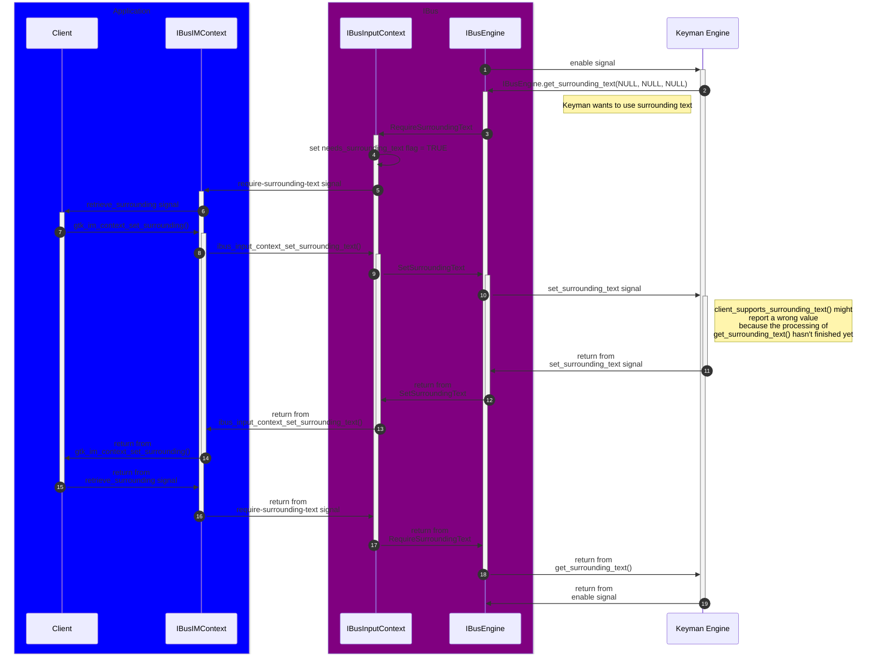

# Communication between Application, IBus, and Keyman

The sequence diagram below shows the sequence of events that happen in
response to IBus sending the "Enable" signal to the Keyman Engine.
This illustrates why `client_supports_surrounding_text()` might return
a wrong value initially.

## Links

- <https://docs.gtk.org/gtk3/class.IMContext.html>
- <https://ibus.github.io/docs/ibus-1.5/IBusInputContext.html>
- <https://ibus.github.io/docs/ibus-1.5/IBusEngine.html>
