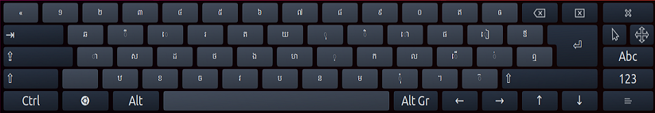

## Q. How do I install Keyman for Linux?
**A.** In Ubuntu and Wasta-Linux, Keyman for Linux can be installed via launchpad:
```bash
sudo add-apt-repository ppa:keymanapp/keyman
sudo apt-get update
sudo apt-get upgrade
sudo apt-get install keyman onboard-keyman
```

An older version of Keyman for Linux packages is also available in any current Debian at: 
[https://packages.debian.org/keyman](https://packages.debian.org/keyman)


## Q. How do I install a Keyman keyboard?
**A.** Follow this [guide](../start/installing-keyboard) for installing Keyman keyboards.

## Q. What's the relationship between Keyman for Linux and KMFL?
**A.** Keyman for Linux and KMFL are released together in the Keyman
[PPA](https://en.wikipedia.org/wiki/Ubuntu#Package_Archives), but are separate. The installation
instructions above will install Keyman, not KMFL. KMFL was developed as a black-box clone of Keyman
for Windows years ago; after Keyman was released as open source it became possible to share the 
code base between Windows and Linux. Keyman for Linux is the long-term supported solution.

## Q. Can I have Keyman for Linux and KMFL installed at the same time?
**A.** Yes. To install KMFL on Ubuntu:
```bash
sudo add-apt-repository ppa:keymanapp/keyman
sudo apt-get update
sudo apt-get upgrade
sudo apt-get install ibus-kmfl
```

## Q. If I already had KMFL installed, how can I uninstall KMFL before installing Keyman?
**A.** It is good to remove any keyboards from ibus e.g. KMFL keyboards before you remove KMFL.
Then, to remove KMFL:
```bash
sudo dpkg --purge ibus-kmfl libkmfl
```

## Q. How do I display the On-screen Keyboard (OSK)?
**A.** From the launcher, enter `onboard`



## Q. What Linux distros will Keyman work with?
**A.** Keyman runs on Debian, Ubuntu, Wasta Linux and can be compiled to run from source in most distributions.

**Note:** Keyman for Linux no longer supports Ubuntu 16.04 LTS (Xenial Xerus).

## Q. Will my existing Windows Keyman keyboard work with Keyman for Linux?
**A.** Most keyboards will work without change. A small subset of keyboards require features which
are not yet available in Keyman for Linux. These features will be progressively implemented.
