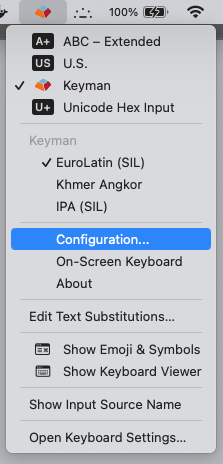
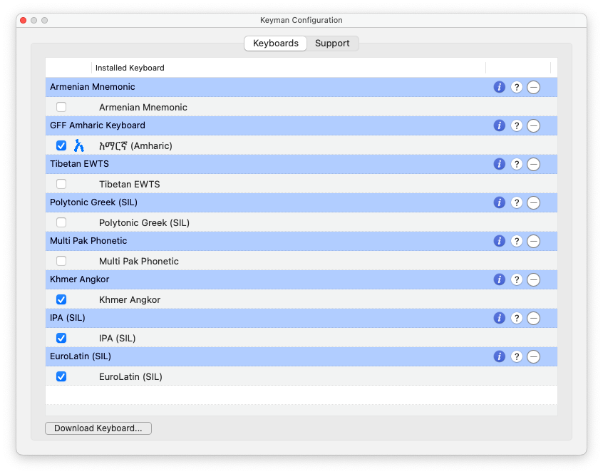

The Configuration window allows you to change several things about the way
Keyman works, as well as access information about installed keyboards.

## Opening Keyman Configuration
To open Keyman Configuration:

1. 

   Make sure that Keyman for macOS is the active input source (as shown above).
   For more information, see [Getting Started with Keyman for macOS](../../start/tutorial).
2. Click the Keyman icon to display the Input menu.
3. On the Input menu, in the section for Keyman, click **Configuration**. Note: If you just
   installed Keyman and the Configuration menu is not available, please restart the computer.

   

4. The Keyman Configuration window appears:
   

## Using Keyman Configuration

Following are instructions for performing various tasks in the Configuration window:

-  [Keyman Configuration - Keyboard Layouts Tab](keyboards)
-  [Keyman Configuration - Support Tab](support)

