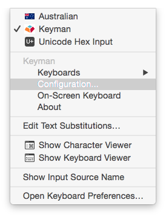

You must have a Keyman keyboard installed to type with Keyman for macOS in your language.

## Downloading and Installing a Keyman Keyboard within Keyman for macOS

Here's how to download and install a Keyman keyboard within Keyman for macOS:

 Watch this video for installing the Khmer Angkor keyboard for Keyman for macOS (0:51)

:

1. Choose Keyman from the Input menu in the menu bar.
2. Open Keyman Configuration, from the Configuration link under Keyman in the Input menu.
   Note: If you just installed Keyman and the Configuration menu is not available, please
   restart the computer.

   

3. Select the Keyboard Layouts tab.
4. Click **Download keyboard…**.
5. From the dropdown boxes, find a language associated with your keyboard and click **Search**.
6. Click **Install Keyboard** for the keyboard you want to install.
7. Click **Done**. The keyboard will be installed automatically and
   you will see a Keyboard/Package Info window.

## Installing a Keyman Keyboard from a Folder on Your Computer

There are two ways to install a keyboard from your computer. The easiest way is simply
to find the keyboard package (.KMP file) on your computer using Finder and double-click.
When prompted whether or not to install the package, click Yes. (If you don't see the
dialog box, it might be hiding behind your Finder window.)

The other way is to drag and drop a keyboard package file onto the Keyman Configuration
window. Here's how:

1. Choose Keyman from the Input menu in the menu bar.
2. Open Keyman Configuration, from the Configuration link under Keyman in the Input menu.

   

3. Select the Keyboard Layouts tab.
4. Back in Finder, find the keyboard package on your computer. Keyman keyboard packages
   have a file name that ends with .kmp.
5. Drag and drop the keyboard package file in the installed keyboards list in Keyman
   Configuration window.

   **Note:** You can drag and drop multiple keyboard packages at once.

## After installation

**Tip:** The Keyboard/Package Info window includes some helpful information about
the keyboard you have installed. In addition to the name and version of the keyboard,
the dialog may also show:
* Fonts installed with the keyboard.
* Author name and contact information.
* Specific help and readme information (under the readme tab).

**Note:** Keyman keyboards are installed for the current user only. You can find
the installed keyboards in 'Documents/Keyman-Keyboards' folder; however, you should
not delete or modify this folder or its contents.

1. To enable/disable a keyboard; click on the check box next to the keyboard.
2. You can now select a Keyman keyboard from the Keyboards menu under Keyman in the
   Input menu.

**Note:** Only enabled keyboards will be displayed in the Keyboards menu under Keyman
in the Input menu.

## Related topics

* [Install Keyman](install-keyman)
* [Keyman Configuration](../basic/config/)
