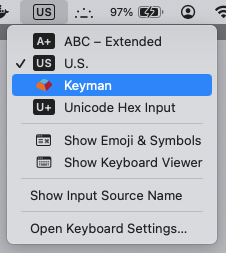
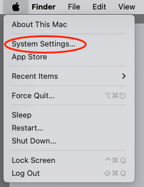
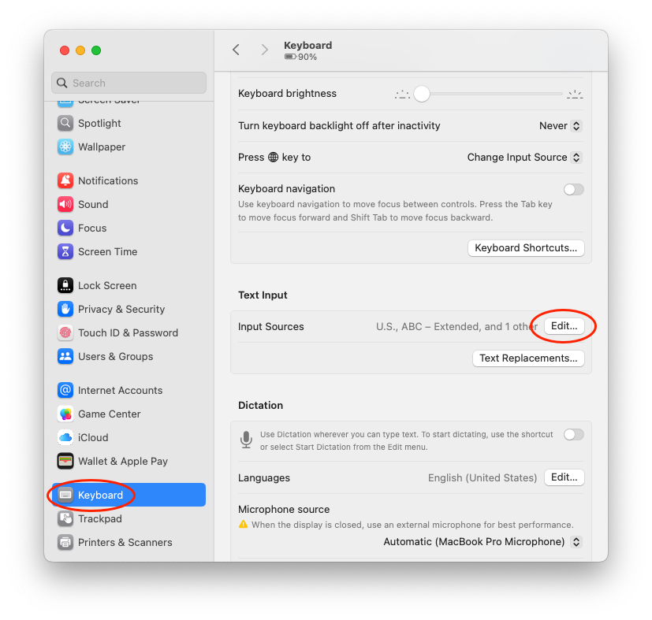
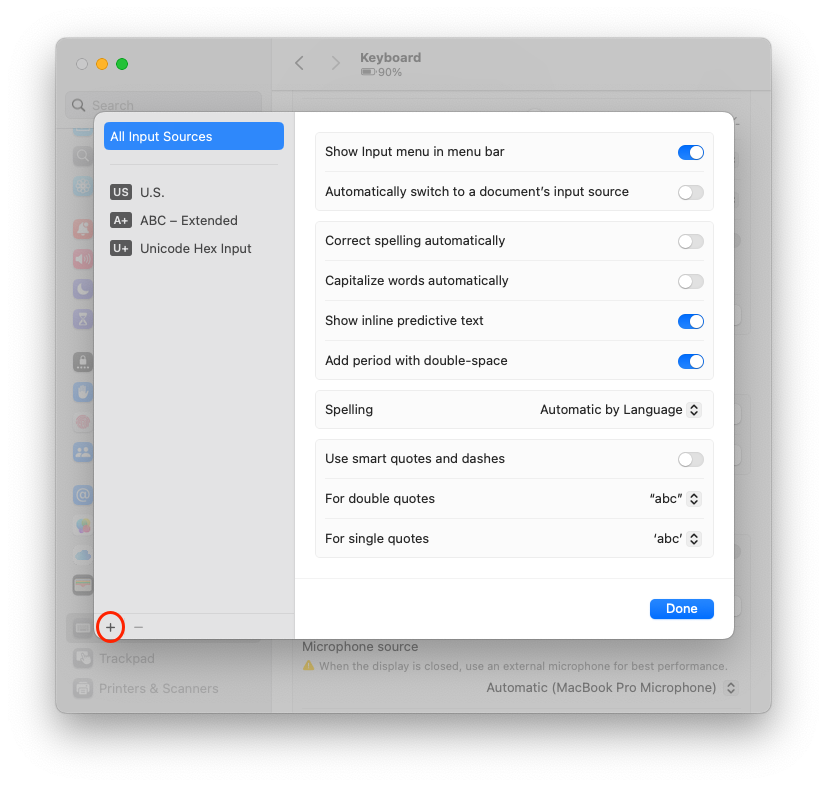
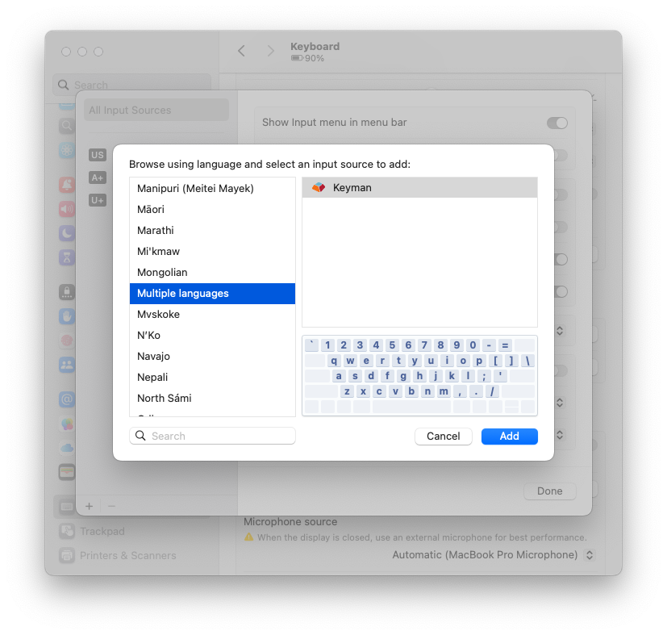
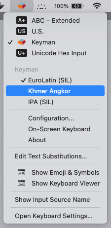
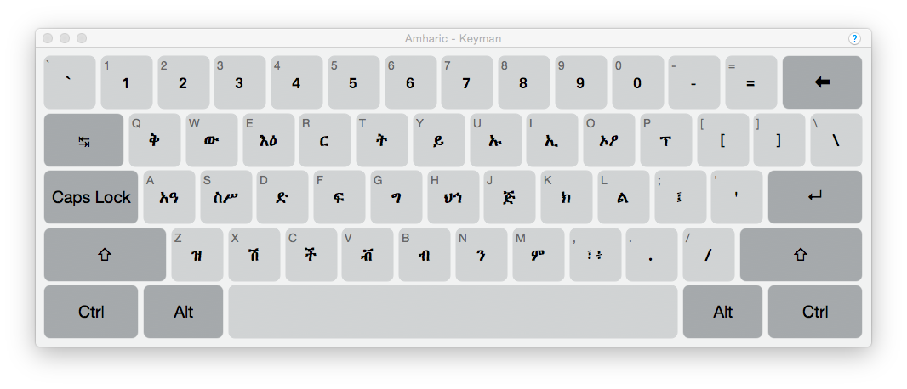

Follow these steps for a basic introduction to Keyman for macOS:

**Note:** *Keyman for macOS* must be installed first. For help on
installing *Keyman for macOS*, please see: [Install Keyman for macOS](install-keyman).

## Step 1: Is Keyman active?

Check the menu bar near the date and time to see if Keyman for macOS is
active. If it is active you will see the Keyman icon: 

* If the Keyman icon is in the menu bar near the date/time, continue on to **Step 4**.

## Step 2: Choose Keyman from Input Menu

If the Keyman icon is not in the menu bar, choose **Keyman** from the Input menu in the
menu bar and continue on to **Step 4**.

The Input menu appears in the menu bar only if you enable 'Show Input menu in menu bar'
under Keyboard settings > Input Sources > Edit. The Input source currently in use is represented in the menu bar by an icon or a symbol containing one or more characters.

If Keyman is not listed in the Input menu, then Keyman for macOS has not been added as an input source.
Follow **Step 3** to add Keyman for macOS as an input source.

## Step 3: Add Keyman for macOS

To add Keyman for macOS as an input source:

1. On the Apple menu, click System Settings

   

2. Click Keyboard, go to the **Text Input** section and then click the Edit... button

   

3. In the Input Sources window, click the plus sign to add a keyboard 

   

4. In the left-hand pane, select **Multiple Languages**, and then select **Keyman** in the
   right-hand pane and click the Add button.

   

Now, return to **Step 2**.

## Step 4: Select a Keyman keyboard

With Keyman selected in the Input menu, select a Keyman keyboard. 

Note: If the Keyman menu items are not available, please restart the computer.

   

**Tip:**: If there are no Keyman keyboards in the Keyboards menu, you can learn
how to install one here: [Install a keyboard](../start/install-keyboard).

## Step 5: Enable the On-Screen Keyboard

To become familiar with the layout of a Keyman keyboard, use the
On-Screen Keyboard tool: On the Input menu, point to Keyman, and then click
On-Screen Keyboard.

**Tip:**: You do not need to use the On-Screen Keyboard in order to type. You can turn it
off at any time.

**Tip:**: Some Keyman keyboards do not include an On-Screen Keyboard. You will see
a standard US keyboard layout if the selected keyboard does not include an
On-Screen Keyboard.

## Step 6: Start typing!

You can now start typing in your language in almost any application. Use your
hardware keyboard or click the keys in the On-Screen Keyboard to type.

**Note:** To return to using your normal keyboard, choose your default keyboard
from the Input menu in the menu bar.
