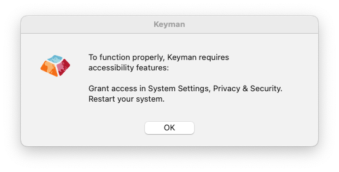
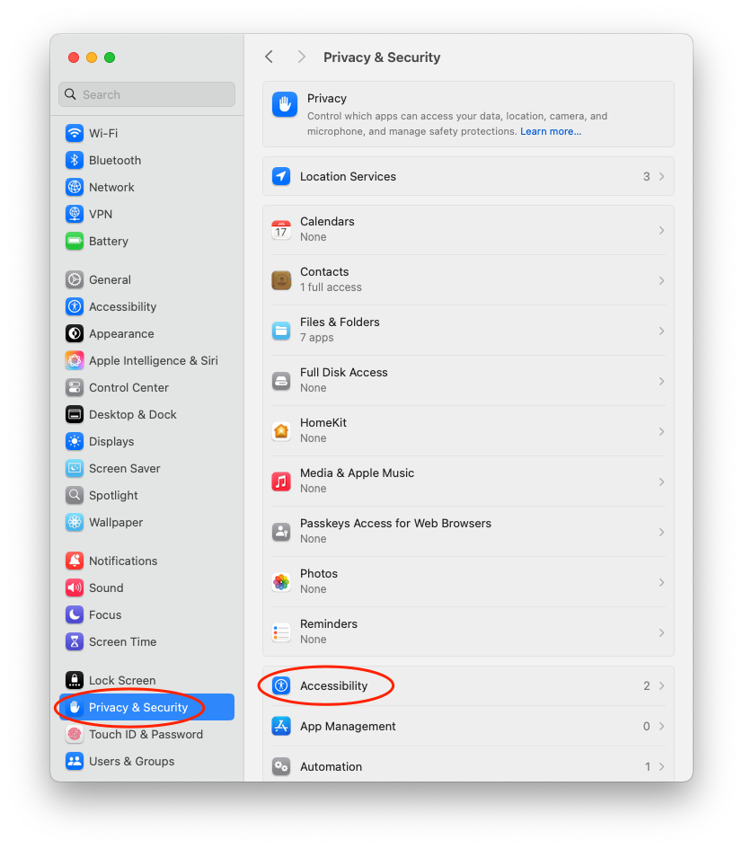
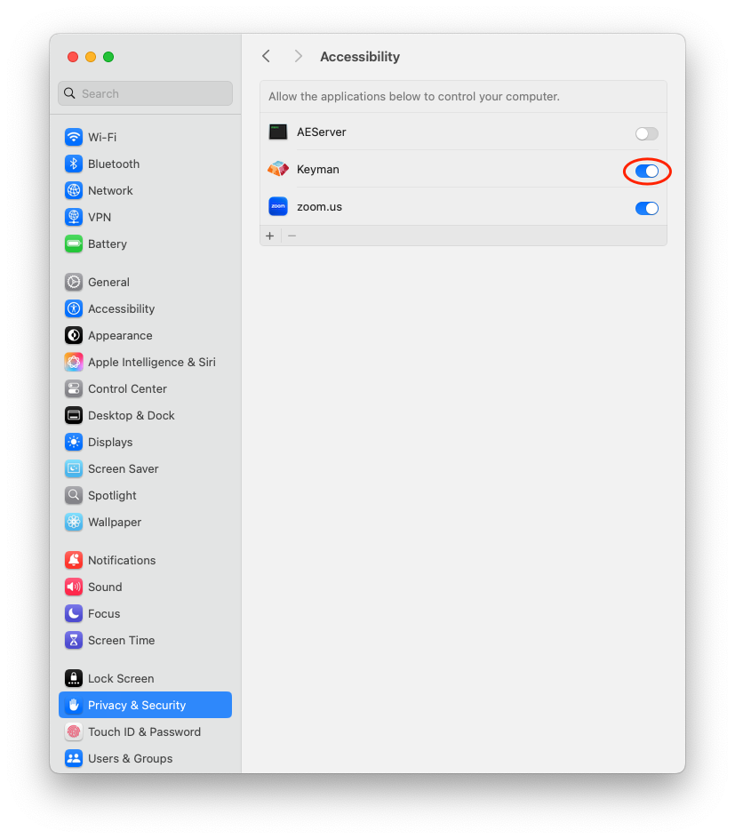

Keyman requires access to your keyboard to translate input. For Keyman to work properly with macOS, you must make a change in System Settings (known as System Preferences prior to macOS 13.0 Ventura).

* **System Settings** >  **Privacy & Security** > **Accessibility**

When you run Keyman for the first time, it will prompt you to enable Accessibility permission for Keyman. When you click the OK button to dismiss the dialog, the System Settings will be automatically be opened to the Accessibility setting.

   

**Note:** The above prompt may not appear until Keyman has been run at least once. If it does not appear and Keyman is not listed in the relevant panes in System Settings, select Keyman from the Input Sources menu and try typing in an app.

Without Accessibility enabled for Keyman, it may not function as expected:

* Some key combinations may not create the correct output while typing
* Some letters may be duplicated or not deleted as expected
* The on-screen keyboard may not produce any output

Follow the steps described below to ensure that Keyman functions properly.

## Enabling Keyman in macOS Privacy & Security Settings

1. From the Apple Menu, select **System Settings**:

   

2. In System Settings, select **Privacy & Security**, and then select **Accessibility** from the displayed list:

   

3. In the Accessibility pane, move the control for **Keyman** to the 'on' position to enable access. You will be asked to enter you password to allow this change.

   

4. After changing these settings, you may need to restart your Mac for them to take effect

## Upgrading macOS

You should only need to undertake this procedure once. However, if you upgrade your
version of macOS, and Keyman stops working, follow these steps to re-enable Keyman.
