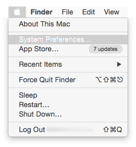
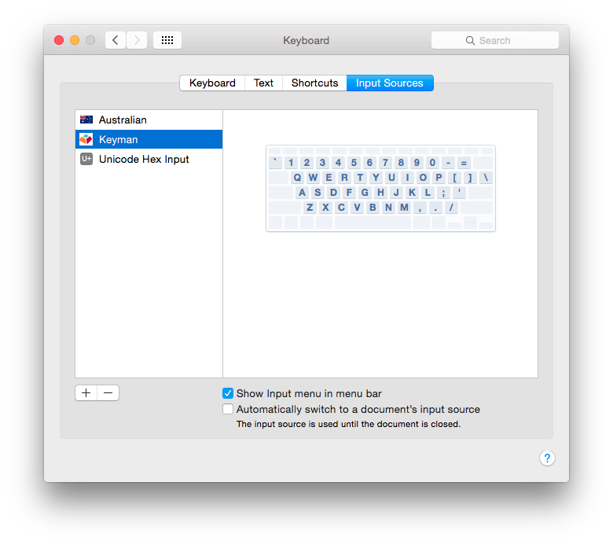
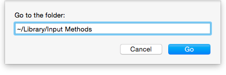

To uninstall Keyman for macOS:

1. Choose Apple menu > System Preferences.

   

2. Click Keyboard, then click Input Sources.

3. Select Keyman, then click :
   

4. In Finder, on the **Go** menu, click **Go to Folder...**

5. Type `~/Library/Input Methods`, then click **Go**
   

6. Right-click Keyman.app and choose **Move to Trash**

**Note:** If you get the error 'The item "Keyman.app" can't be
moved to the Trash because it's open', log out and log back in
or restart your Mac and repeat the last step.
