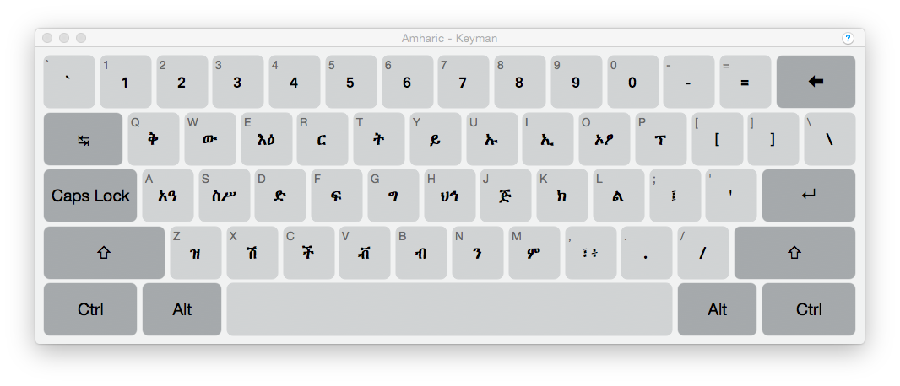

Thank you for installing Keyman for macOS. Whether you're a new or returning user, 
we believe you will appreciate the significant enhancements in this latest
version of Keyman for macOS.

## What is Keyman for for macOS?

Keyman for macOS brings an extensive library of keyboards for over 1,000 
languages to macOS. You can even create your own custom keyboards with 
[Keyman Developer](https://keyman.com/developer) (a Windows product).

Our unique virtual keyboard technology makes it easy to type in all your programs, 
including Microsoft Office, Adobe Creative Suite, internet browsers and more, as well as 
supporting the latest version of macOS.

A list of new features in Keyman is available [here](whatsnew).

## Related Topics

-  [What's New](whatsnew)
-  [System Requirements](requirements)
