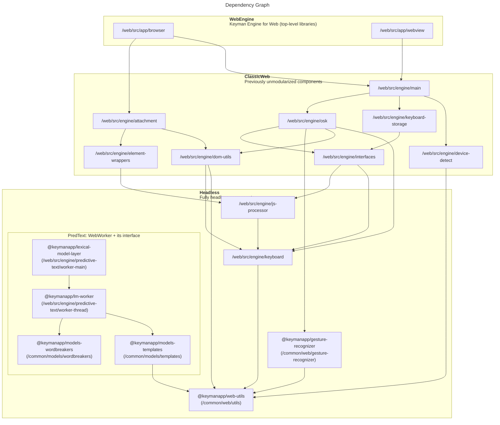

# Keyman Engine for Web
The Original Code is (C) SIL International

## Prerequisites
See [build configuration](../docs/build/index.md) for details on how to
configure your build environment.

**********************************************************************

The following folders contain the distribution for Keyman Engine for Web:

```text
src                        Source code
build/app/resources        OSK + UI resources for inclusion in all build types;
                           keymanweb-osk.ttf is maintained at https://github.com/silnrsi/font-keymanweb-osk

build/app/browser/release  Fully-compiled KeymanWeb modules for release
build/app/webview/release  Fully-compiled KMEA/KMEI modules for inclusion in
                           mobile app builds
build/app/browser/debug    Fully-compiled but non-minified KeymanWeb modules
build/app/webview/debug    Fully-compiled but non-minified KMEA/KMEI modules

src/samples                Sample pages demonstrating ways to link with KeymanWeb
src/test/manual            Test-case web-pages for various aspects of KeymanWeb functionality
src/test/auto              A Node-driven test suite for automated testing of KeymanWeb
```

**********************************************************************

## Usage

Open **index.html** or **samples/index.html** in your browser. Be sure to
compile Keyman Engine for Web before viewing the pages.

Refer to the samples for usage details.

To view pages using compiled Keyman Engine for Web,

1. cd to **keyman/web/**
2. Run `./build.sh`
   - Use `./build.sh --help` for the script's documentation.

### Unit Testing

Before running unit tests on Keyman Engine for Web, first run `./build.sh`
according to the instructions above.

Once the build is complete, running `npm test` will run the unit testing suite
on your local machine in-browser. Alternatively, see `test.sh`, which
the former command executes.

### Debugging Unit Tests

1. During development, to run a specific unit test, change the `it` to
   `it.only`. You can also run all tests under a specific group with
   `describe.only`.
2. From this directory, run `./test.sh --debug`. Alternatively, from
   `web/` or any `web/` subdirectory,

   ```bash
   npm run test -- --debug
   ```

   The `--` part tells `npm` to funnel anything to the script as the script's
   command-line parameters. As long as it's run from somewhere within the `web/`
   folder's hierarchy, that line will always run from `web/`, as that's where
   `package.json` is.

3. When the browser halts, click the "Debug" button which opens a new debugging
   tab.
4. In the Dev console, you can set a breakpoint in your test and refresh the
   page to debug

### Approximate Overall Design


