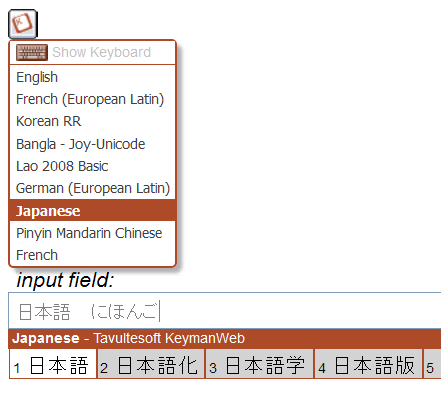

  
The simplest user interface is the "button" UI, which appears at a fixed
position on the web page, and is attached to an empty 'Div' element with
id='KeymanWebControl' added to the page where appropriate.

When the mouse is hovered over the 'button' UI, a menu of supported
input languages and keyboards is shown:

In this example, a Japanese keyboard with an Input Method Editor (IME)
has been selected.
