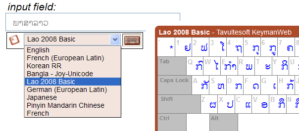

  
The "float" user interface (the original
*KeymanWeb* user interface) appears as a
drop-down list of available keyboards below the currently focused
element:

An initialization option allows the interface element to be aligned at
the right of the focused element if preferred.
