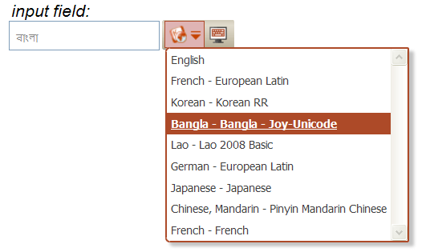

  
The "toggle" user interface provides a drop-down list of supported input
languages and keyboards, and moves with the focus to appear at the right
hand side of the focused element:

The "toggle" interface also supports the use of "hot keys" to simplify
keyboard use:

| Hot key                                      | Action                                     |
|:---------------------------------------------|:----------------------------------------|
| *Ctrl /*                                  | enable/disable currently selected keyboard |
| *Ctrl Shift /*                            | select next listed keyboard                |
| *Alt /*                                   | enable/disable OSK display                 |

