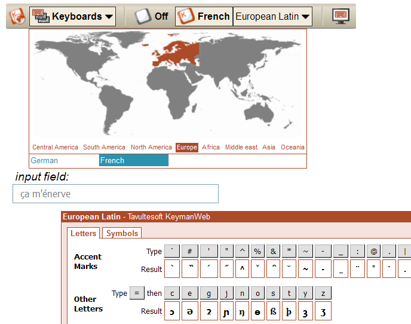

  
For pages which must support a large number of languages from many
regions, we recommend using our "toolbar" user interface, which displays
a drop-down map allowing users to first choose the region from the map
or by name, then select input language by country. A second drop-down
list is displayed (as shown here) if more than one keyboard is available
for the selected language.

The "toolbar" user interface is attached to any DIV element on the page
(by giving that element the
*id='KeymanWebControl'*), and remains
fixed in position with respect to that element, but the On-Screen
Keyboard moves to each focused input element, unless fixed in position
by the user.

