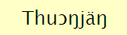
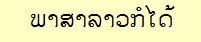

KeymanWeb allows users to display and enter text that may require a font
not normally installed with your operating system, by including
(embedding) a special copy of a suitable font in the web page.

However, many older browsers do not support the use of embedded fonts.
This test page will help you to find out whether or not your browser
supports the use of embedded fonts for a number of languages which may
not be fully supported by your operating system.

In the table below, the left column has an image showing how the sample
text should appear, the center column displays the sample text using a
font installed on your system, if available, and the right column shows
the same sample text displayed using an embedded font downloaded
automatically with this web page.

---
**Note:** This page may take a minute or more to load all of the fonts
needed to display correctly.

---

| Language | Sample text - image | Sample text - installed font | Sample text - embedded font\* |
|----------|---------------------|------------------------------|-------------------------------|
| Amharic   |     | ኢትዮጵያ       | ኢትዮጵያ |
| Burmese   |  | မြန်မာအက္ခရာ   | မြန်မာအက္ခရာ |
| Dinka     |    | Thuɔŋjäŋ     | Thuɔŋjäŋ |
| Khmer     |    | ភាសាខ្មែរ     | ភាសាខ្មែរ |
| Lao       |      | ພາສາລາວກໍໄດ້   | ພາສາລາວກໍໄດ້ |
| Oriya     |    | ଓଡ଼ିଆ          | ଓଡ଼ିଆ |
| Sinhala   |  | සිංහල       | සිංහල |
| Tamil     |    | தமிழ்       | தமிழ் |
| Tibetan   |  | བོད་ཡུལ།         | བོད་ཡུལ། |

---
**If the embedded font display for a language is not exactly the same as in the corresponding image,** 
for example, with script characters shown
but incorrectly positioned or ordered, you will need to install the
Keyman Desktop package for your language onto your computer. You can
download the Keyman Desktop package by clicking the "Help on this
keyboard" link in the On Screen Keyboard. This is likely to be observed
with scripts such as Burmese, Khmer or Tibetan if your operating system
does not fully support the display of the font used for those scripts.

---

## More Help

If you are experiencing continued difficulty in using KeymanWeb and have not been able to find a solution on this site, [please contact us](/contact).

