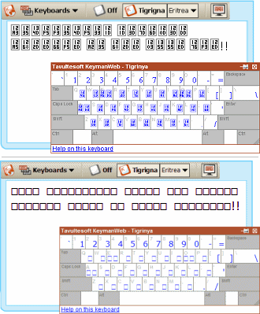
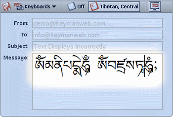

Listed below are some difficulties occasionally experienced when using
KeymanWeb. The information on this page is continually reviewed and
updated, and other questions are addressed in the [Keyman Community](https://community.software.sil.org/c/keyman).

- [Why are boxes appearing when I type?](#boxes)
- [Why isn't my language appearing correctly?](#one)
- [Why can't I see the On-Screen Keyboard?](#two)
- [Why can I only type in English?](#three)

#### Boxes (Characters do not Appear)

If empty boxes, or boxes containing Unicode character codes, appear in
your text box when you type (and/or on the On-Screen Keyboard), as in
the images on the right, please check the following:

-   Confirm that your browser supports embedded fonts and is up to date,
    as some earlier versions of browsers do not include this feature. In
    this case, to enable KeymanWeb to function properly, you will need
    to update your browser or download the specific font required for
    your keyboard.
-   If you copy and paste text that you have typed in KeymanWeb into
    another application such as Microsoft Word, you may find that it
    does not display. In this case, you will need to installing the
    Keyman Desktop package for the keyboard onto your computer. You can
    download the Keyman Desktop package by clicking the "Help on this
    keyboard" link in the On Screen Keyboard.
-   An [embedded font test page](embedded_fonts) is available for further testing of embedded font support on your computer.

#### Characters are not Displayed Correctly

If you find that you can see the characters for a language on screen,
but they don't display quite right, you may be experiencing a limitation
in your operating system. An example of this is visible in the Tibetan
script on the right. Installing Keyman Desktop or Keyman for Mac may
help resolve these issues.

#### Disappearing On-Screen Keyboard

If the [On-Screen Keyboard](osk) does not appear, or disappears as soon
as you move it, please check the following:

-   Make sure KeymanWeb is activated by clicking in the text area.
-   Confirm that the [On-Screen Keyboard](osk) is turned on. In the
    **Button** interface, the first item in the Keyboard Menu should be
    , while in the other user
    interface designs, the On-Screen Keyboard icon  should have a box around it.
-   Ensure that a keyboard has been actively selected. The On-Screen
    Keyboard will not display for the default operating system keyboard,
    which is generally available as the first selectable keyboard on
    KeymanWeb desktop user interfaces.
-   Scroll up and down (and across if necessary) the website to see if
    the On-Screen Keyboard is actually being displayed, but is in a
    different position.
-   For more information on using the On-Screen Keyboard, [click
    here](osk).

#### English Letters

If English letters appear when you type, rather than your language,
please check the following:

-   Confirm that KeymanWeb is activated for the textbox or text area you
    are typing into.
-   Make sure you have selected the correct keyboard for the language
    you wish to use. Some languages use more than one writing system,
    and these are often available as different keyboards.
-   For more information on the KeymanWeb user interfaces, [click
    here](../ui).

#### More Help

If you are experiencing continued difficulty in using KeymanWeb and have not been able to find a solution on this page, [click here](/contact).

  
