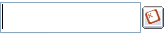
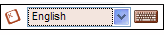
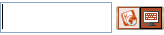

## User Interface options

As a web-based language solution, KeymanWeb can be used for an extremely
wide variety of applications. A range of standard User Interface designs
have been included to provide flexibility in incorporating KeymanWeb
into a website. This allows developers to select an interface which best
complements their website design. Customised designs can be developed to
suit specific site requirements. Please [contact support](/contact/)
for more information.

Using the various interfaces is largely similar, but because the
appearance of each is quite distinct, they are dealt with in different
sections of this help documentation. Please click on the links below for
more information on the interface you are using.

<table class="display_grid" style="text-align:center" data-border="0"
data-cellpadding="12">
<colgroup>
<col style="width: 33%" />
<col style="width: 33%" />
<col style="width: 33%" />
</colgroup>
<tbody>
<tr>
<td data-valign="top"> 
<a href="ui-button">Button
Interface</a></td>
<td></td>
<td data-valign="top"> 
<a href="ui-floating">Floating
Interface</a></td>
</tr>
<tr>
<td data-valign="top"> 
<a href="ui-toggle">Toggle
Interface</a></td>
<td></td>
<td data-valign="top"> 
<a href="ui-toolbar">Toolbar
Interface</a></td>
</tr>
<tr>
<td colspan="3" style="text-align: left;">More information is also
available on how to use the On Screen Keyboard.</td>
</tr>
<tr>
<td colspan="3" data-valign="top"> 
<a href="osk">On Screen
Keyboard</a></td>
</tr>
</tbody>
</table>

