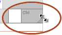

### What is a Keyboard?

When using KeymanWeb, the term *keyboard* refers specifically to
the way the keys are arranged for a specific language (i.e. which letter
or character appears when a given key is pressed). Some languages have
more than one keyboard layout; a typewriter-based layout and a phonetic
layout, for example.

This page gives information about KeymanWeb's On-Screen Keyboard: the
map of the keyboard which appears on a website when KeymanWeb is in use.

[More about KeymanWeb keyboards](../../current-version/guide/what-is-a-keyboard)

### On-Screen Keyboard

The **On-Screen Keyboard** *(above)* displays the layout of the keyboard
you are currently using. When you press any key, the blue character or
letter marked on the On-Screen Keyboard will appear in the textbox. Many
keyboards also use combinations of **Shift**, **Ctrl** or **Alt** and
letter keys to include more characters. When Shift, Ctrl or Alt is
pressed, the On-Screen Keyboard display will change to show these
characters.

You can also use the On-Screen Keyboard to enter text directly, without
pressing any keys on your physical keyboard. Click once on any character
displayed on the On-Screen-Keyboard, and it will be entered into the
textbox. Shift-, Ctrl- and Alt- combinations also work with this method:
click once on Shift, for example, and it will stay 'pressed' until it is
clicked again or the physical Shift key is pressed. Although text entry
using this method can be less efficient, it can be useful when a
non-English physical keyboard is attached to the computer in use.

### Moving and Hiding the On-Screen Keyboard

The On-Screen Keyboard can be moved to any area of the website which is
being displayed. It can be placed in a more convenient position for
referring to when typing, or moved out of the way if it is obscuring
part of the textbox or another part of the screen. To move the On-Screen
Keyboard, move the mouse pointer over the On-Screen Keyboard's title bar
(where the title 'Tavultesoft Keyman' is displayed), and the pointer
will change to a four-way arrow. Hold down the left mouse button, drag
the Keyboard to your desired posistion and release the mouse button. The
On-Screen Keyboard will remain in the new position until it is moved
again.

When you move the On-Screen Keyboard, a drawing pin icon
 will appear in the title bar. Clicking on the
drawing pin icon will return the On-Screen Keyboard to its original
position near the KeymanWeb Control.

If you are familiar with the layout of the keyboard in use and do not
need to refer to the On-Screen Keyboard, it can be hidden (and displayed
again if necessary) using the KeymanWeb Control. The method for hiding
and displaying the On-Screen Keyboard varies slightly (it is done
through either a menu item or a button) depending on which User
Interface is configured on your website. Please refer to the specific
[User Interface pages](../ui) for more details.

### Resizing the On-Screen Keyboard

You can also change the size of the On-Screen Keyboard. For example, you
may choose to make the On-Screen Keyboard smaller, instead of moving it,
to better fit it on your screen; or you might like to enlarge the
On-Screen Keyboard to make it clearer and easier to refer to.

To resize the On-Screen Keyboard, move the mouse pointer over the shaded
corner of the 'Ctrl' Key at its bottom right. When the pointer changes
to a diagonal two-way arrow, hold down the left mouse button and drag
the mouse to make the On-Screen Keyboard larger or smaller. Releasing
the mouse button will set the size, and the On-Screen Keyboard will
remain the new size until it is resized again.

### Information on Specific Keyboards

KeymanWeb supports a very wide range of languages, and many keyboards
available for use with KeymanWeb include features specific to particular
languages. Because of this, each keyboard has its own documentation,
which can be accessed by clicking on the <ins>Help on this Keyboard</ins>
link at the bottom of the On-Screen Keyboard. Although the level of
detail in this documentation does vary somewhat, depending on the
designer and the requirements of each keyboard, this is the first place
to look for information on using a particular language with KeymanWeb.
